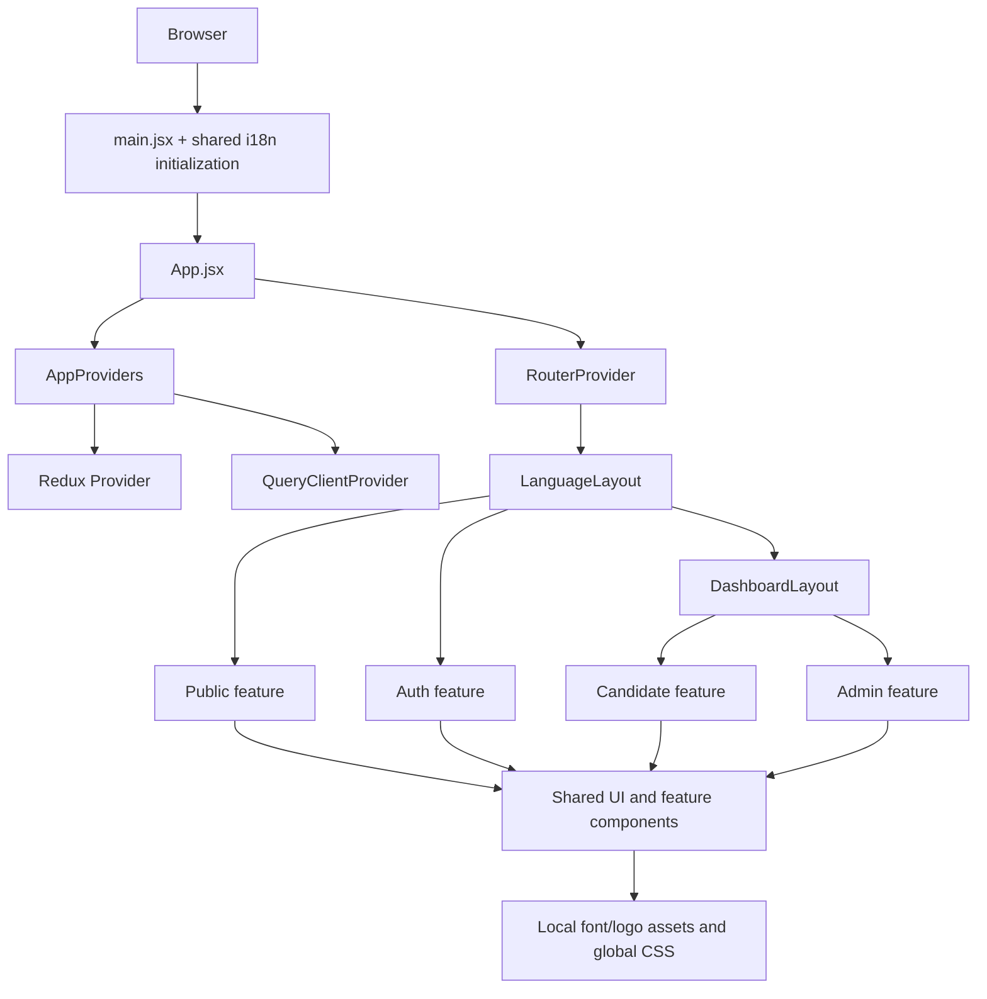

# MatchIn Frontend — Codebase Architecture & Developer Guide

> **Document type:** Living frontend architecture and maintenance guide
> **Last refreshed:** 2026-09-24
> **Committed code baseline:** `d9eaed0` (`ahmed`, also `origin/ahmed` at refresh time)
> **Working-tree scope:** Includes the current modified `src/app/routes/dashboard.routes.jsx` and untracked `src/features/admin/pages/CmsHomePage.jsx`. The CMS page/route is marked **WIP** throughout this document.
> **Validation at refresh:** `npm run build` passes; `npm run lint` reports **0 errors and 32 warnings**.
> **Change policy:** This refresh audits the implementation but changes no application source files.

---

## Table of Contents

1. [Executive Snapshot](#1-executive-snapshot)
2. [Changes Since the Previous Guide](#2-changes-since-the-previous-guide)
3. [Technology Stack](#3-technology-stack)
4. [Runtime Architecture](#4-runtime-architecture)
5. [Source Layout and Ownership](#5-source-layout-and-ownership)
6. [Feature-Domain Map](#6-feature-domain-map)
7. [Routing, Localization, and Role Selection](#7-routing-localization-and-role-selection)
8. [Layouts, Navigation, and Route Metadata](#8-layouts-navigation-and-route-metadata)
9. [Authentication and Authorization](#9-authentication-and-authorization)
10. [API, TanStack Query, Redux, and Mock Data](#10-api-tanstack-query-redux-and-mock-data)
11. [Forms and Validation](#11-forms-and-validation)
12. [UI System, Styling, Motion, and Feedback](#12-ui-system-styling-motion-and-feedback)
13. [Internationalization and RTL](#13-internationalization-and-rtl)
14. [Naming, Imports, Exports, and Placement](#14-naming-imports-exports-and-placement)
15. [Dependency Guide](#15-dependency-guide)
16. [Development Workflows](#16-development-workflows)
17. [Current Gaps and Risks](#17-current-gaps-and-risks)
18. [Developer Cheat Sheet](#18-developer-cheat-sheet)

---

## 1. Executive Snapshot

MatchIn is a role-oriented React single-page application for a public job platform. It currently contains four feature domains:

- `public` — landing page and 404 page.
- `auth` — login, registration, OTP, CV upload, password recovery, and password reset UX.
- `candidate` — jobs, saved jobs, applications, profile, CV management, notifications, onboarding, roadmap, AI chat, and overview.
- `admin` — overview, job/user management, audit logs, and a **WIP** home-page CMS editor.

The application has moved beyond the small, single-screen prototype described by the previous guide. It now has a modular route tree, role-oriented feature groups, broad candidate workflows, an admin area, shared loading/empty/error patterns, Arabic/English localization, and substantially more UI primitives.

However, it is still primarily a **high-fidelity frontend implementation backed by local/static data**. No current authentication, query, mutation, or feature-data flow is connected to a backend. TanStack Query and Redux are mounted at the root but own no application data or authenticated user state.

### 1.1 Current Size

Counts below include the current working tree and exclude `node_modules/` and generated `dist/`:

| Area | Current count / state |
| :--- | :--- |
| Files physically under `src/` | 467, including 147 local font files |
| JavaScript/JSX modules | 300: 251 `.jsx` and 49 `.js` |
| Feature modules | 220 across four domains |
| Admin feature modules | 64, including the WIP CMS page |
| Auth feature modules | 29 |
| Candidate feature modules | 102 |
| Public feature modules | 25 |
| Global UI primitives | 20 |
| Static/mock constant modules | 18 |
| Tests | None found; no `test` script is defined |

### 1.2 Committed Change Since the Previous Guide Snapshot

From the guide's last code-aligned snapshot (`a6e7caa`) to `d9eaed0`:

- 32 commits landed, including 18 non-merge commits.
- 263 implementation/config files changed (excluding this guide).
- 8,203 implementation/config lines were added and 1,490 removed.
- The codebase was reorganized around role-oriented feature groups.
- Candidate and admin functionality expanded substantially.
- Authentication UX was refactored and expanded.
- Layouts were moved out of the misleading `layouts/auth/` directory.
- Localization and RTL support were introduced.

The current working tree adds one modified route module and one untracked CMS page, documented as WIP rather than stable architecture.

### 1.3 Build and Quality Snapshot

| Check | Result |
| :--- | :--- |
| `npm run build` | Passes with Vite 8.2.2 |
| Production JavaScript | Approximately 1.13 MB before gzip; approximately 341 KB gzip |
| `npm run lint` | 32 warnings, 0 errors |
| Unit/component tests | Not configured or present |
| Type checking | Not configured; the project is JavaScript/JSX |

The build succeeding does not imply backend integration: most asynchronous behavior is simulated inside components with `setTimeout` and local state.

---

## 2. Changes Since the Previous Guide

The previous guide is no longer an accurate description of this repository. The major changes are:

### 2.1 Feature Reorganization

The former top-level feature folders such as `HomePage`, `Auth`, `jobsFeed`, `applications`, `profile`, `roadmap`, and `userDashboard` were consolidated into:

```text
src/features/
├── public/
├── auth/
├── candidate/
└── admin/
```

`candidate` now acts as an aggregate feature area containing the candidate-facing pages and their feature-local components.

### 2.2 New Candidate Surface

The current candidate area includes page modules for:

- Overview
- Jobs and job details
- Saved jobs
- Application tracker and application details
- Candidate profile
- CV management
- Notifications
- Onboarding
- Roadmap and roadmap details
- AI chat

These pages are substantially more complete than the old one-page dashboard described in the previous guide, but most continue to use local mock datasets and local component state.

### 2.3 New Admin Surface

Committed admin work currently provides:

- `AdminOverview`
- `JobManagement`
- `JobDetailsPage`
- `UserManagementPage`
- `UsersDetailsPage`
- `AuditLogsPage` and `AuditLogsDetailsPage`
- Feature components for job management, job detail, user management/detail, audit-log lists, and audit-log details
- Expanded reusable admin controls/states under `src/features/admin/shared/`
- `ApplicationSkeleton`, `JobDetailsSkeleton`, `StatsStripSkeleton`, and `UsersTableSkeleton`

The current working tree additionally contains one **WIP** page:

- `src/features/admin/pages/CmsHomePage.jsx` — a large bilingual home-page content editor with local draft persistence and simulated publishing.

The route module is also modified to register the CMS page, but it currently contains a duplicate `path` key that causes the admin job-detail route to be overwritten by the audit-log route.

### 2.4 Authentication Refactor

Authentication files were moved from `features/Auth/` to `features/auth/` and reorganized under `components/`, `pages/`, `schema/`, `shared/`, and `api/`.

The old duplicate implementations were partly resolved by introducing shared auth components such as:

- `PasswordInput.jsx`
- `SequentialFormMessage.jsx`
- `AuthHeader.jsx`
- `SecurityNotice.jsx`
- `AuthSidePanel.jsx`

The malformed `Authsidepanel .jsx` filename no longer exists.

### 2.5 Layout Restructuring

Layouts are now directly under `src/components/layouts/`:

- `MainLayout.jsx`
- `AuthLayout.jsx`
- `DashboardLayout/`

The previous `src/components/layouts/auth/` grouping has been removed.

### 2.6 Localization and RTL

A shared localization layer now exists under `src/components/shared/i18n/`, with English and Arabic resources. Language switching, stored language preference, and RTL-aware CSS work are part of the current application.

### 2.7 UI Expansion

The UI primitive layer now contains 20 primitives, including newer additions such as `avatar.jsx`, `sheet.jsx`, and `skeleton.jsx`. Shared application components include language controls, modals, status views, and action banners; admin-specific page headers, skeletons, badges, and filters live under `features/admin/shared/`.

---

## 3. Technology Stack

| Concern | Technology |
| :--- | :--- |
| UI runtime | React 19.2.8 / React DOM 19.2.8 |
| Build | Vite 8.2.2 with `@vitejs/plugin-react` |
| Styling | Tailwind CSS 4.3.3 through `@tailwindcss/vite` |
| Routing | React Router DOM 7.18.3 |
| Component primitives | shadcn/ui-style components using Radix UI and CVA |
| Animation | Framer Motion 13.2.0 |
| Forms | React Hook Form 7.88.0 and Zod 4.6.1 |
| Resolver bridge | `@hookform/resolvers` 5.9.1 |
| Server-state infrastructure | TanStack React Query 5 |
| Client-state infrastructure | Redux Toolkit and React Redux |
| HTTP | Axios 1.20.0 |
| Icons | Lucide React |
| Internationalization | i18next and react-i18next |
| Linting | Oxlint |
| Language | JavaScript and JSX; no TypeScript source setup |

React Compiler is not enabled. The project does not define unit-test, formatting, type-check, or CI scripts.

---

## 4. Runtime Architecture

### 4.1 Bootstrap Flow

```text
src/main.jsx
  ├── imports src/index.css
  ├── initializes shared i18next resources
  └── mounts <App /> in React StrictMode
              │
              ▼
src/app/App.jsx
      │
      └── AppProviders
          ├── Redux <Provider>
          └── TanStack QueryClientProvider
              └── React RouterProvider
                      │
                      ▼
              src/app/router.jsx
                      │
                      ├── / -> RootRedirect -> /en or /ar
                      ├── /:lang -> LanguageLayout
                      │     ├── RouteTracker
                      │     ├── I18nSync
                      │     └── public/auth/dashboard routes
                      └── * -> NotFoundPage
```

`src/main.jsx` imports the active shared i18n module before mounting React. `App.jsx` adds the root providers and router. Redux wraps Query, which wraps `RouterProvider`. Language synchronization is performed by `LanguageLayout`, not by `AppProviders`.

### 4.2 Architectural Classification

The current structure is a **role-first hybrid feature architecture**:

- Top-level feature domains represent audience or role: `public`, `auth`, `candidate`, and `admin`.
- Each domain owns feature-local pages, components, hooks, schemas, and shared components where appropriate.
- Cross-domain infrastructure remains centralized under `src/app`, `src/components`, `src/lib`, `src/services`, `src/store`, and `src/utils`.
- Static domain data is still mostly centralized in `src/constants/`.

### 4.3 Layer Model



### 4.4 Provider Intent Versus Current Use

- Redux is mounted, but the store has an empty reducer map and no slices.
- TanStack Query and its devtools are mounted, but the current `src/` tree contains no `useQuery`, `useMutation`, or `useQueryClient` calls.
- Most data is imported from constants or declared directly in component modules.
- Most simulated server operations are managed with local `useState` and `setTimeout`.

This distinction is important: infrastructure presence must not be interpreted as live data integration.

### 4.5 Deployment Routing

`vercel.json` rewrites every request to `/index.html`, allowing React Router to handle direct localized URLs such as `/ar/dashboard` during browser-side navigation. `public/` contains the deployed favicon and icon sprite; `dist/` and `node_modules/` are ignored generated/dependency directories.

---

## 5. Source Layout and Ownership

### 5.1 Major Source Tree

Root-level development/deployment files are `package.json`, `package-lock.json`, `vite.config.js`, `jsconfig.json`, `.oxlintrc.json`, `components.json`, `vercel.json`, `index.html`, `README.md`, and `public/` assets. The README is still the generic Vite template and is not a reliable setup guide; use this document plus `package.json` instead.

The following is a practical source map rather than an exhaustive listing of every page-local component:

```text
src/
├── app/
│   ├── App.jsx
│   ├── providers.jsx
│   ├── router.jsx
│   ├── providers/
│   │   └── I18nProvider.jsx            # Empty, currently unused
│   └── routes/
│       ├── RootRedirect.jsx
│       ├── RouteTracker.jsx
│       ├── LanguageLayout.jsx
│       ├── auth.routes.jsx
│       └── dashboard.routes.jsx
├── assets/
│   ├── fonts/                         # Local Inter, Tajawal, DM Sans, and Alexandria files
│   ├── icons/                         # Third-party/service icons
│   └── logo/                          # MatchIn light/dark/wordmark assets
├── components/
│   ├── layouts/
│   │   ├── AuthLayout.jsx
│   │   ├── MainLayout.jsx
│   │   ├── DashboardLayout/
│   │   │   ├── DashboardLayout.jsx
│   │   │   ├── DashboardFooter.jsx
│   │   │   ├── Sidebar.jsx
│   │   │   └── Topbar.jsx
│   │   └── skeleton/
│   │       ├── ApplicationSkeleton.jsx
│   │       ├── JobDetailsSkeleton.jsx
│   │       ├── StatsStripSkeleton.jsx
│   │       └── UsersTableSkeleton.jsx
│   ├── shared/
│   │   ├── ActionBanner.jsx
│   │   ├── JobCard.jsx
│   │   ├── LanguageSwitcher.jsx
│   │   ├── LanguageToggle.jsx
│   │   ├── Loader.jsx
│   │   ├── Modal.jsx
│   │   ├── Navbar.jsx
│   │   ├── PageHeader.jsx
│   │   ├── Status.jsx
│   │   ├── Toast.jsx
│   │   └── i18n/
│   └── ui/                            # 20 shadcn/Radix-style primitives
├── constants/                         # 18 static data/style modules
├── features/
│   ├── public/
│   ├── auth/
│   ├── candidate/
│   └── admin/
├── lib/
│   ├── axios.js
│   ├── i18n.js
│   ├── queryClient.js
│   └── utils.js
├── services/
│   └── axios/
│       ├── axiosInstance.js
│       └── interceptors.js
├── store/
│   └── index.js
├── utils/
│   ├── buildSidebarNav.js
│   └── routes.js
├── index.css
└── main.jsx
```

`src/hooks/` and `src/pages/` exist as workspace directories but do not own the current source implementation. Feature hooks and pages live under their feature domains.

### 5.2 Responsibility Matrix

| Directory | Responsibility |
| :--- | :--- |
| `src/app/` | Application bootstrap, providers, router composition, route modules, redirects, and route tracking |
| `src/assets/` | Local fonts, logos, and service icons |
| `src/components/layouts/` | Auth, public, and dashboard/admin page shells |
| `src/components/shared/` | Cross-feature application components and localization infrastructure |
| `src/components/ui/` | Reusable low-level UI primitives |
| `src/constants/` | Static/mock datasets, route/navigation metadata, and style lookup maps |
| `src/features/` | Role/domain business UI, pages, feature components, schemas, and feature-local state |
| `src/lib/` | Reusable clients and framework configuration |
| `src/services/` | Axios instances and interceptors |
| `src/store/` | Redux store and future global client slices |
| `src/utils/` | Language/path helpers and sidebar navigation construction |

---

## 6. Feature-Domain Map

### 6.1 Public Domain — `src/features/public/`

Purpose: public acquisition and fallback pages.

- `pages/HomePage.jsx` composes the landing-page sections.
- `pages/NotFoundPage.jsx` renders the catch-all 404 page.
- `components/HomePage/` contains the header, footer, hero, jobs preview, categories, philosophy, “why MatchIn,” CTA, and newsletter sections.
- `hooks/` contains `useCountUp.js` and `useMouseSpotlight.js`.

The landing page is visually complete and localized but remains data-driven primarily by static constants and local interactions. `NotFoundPage.jsx` is still a minimal, unstyled, English-only fallback outside `LanguageLayout`.

### 6.2 Auth Domain — `src/features/auth/`

Purpose: unauthenticated identity and account-recovery workflows.

```text
auth/
├── api/auth.api.js
├── components/
│   ├── LoginPage/
│   ├── RegisterPage/
│   └── SetNewPasswordPage/
├── pages/
│   ├── LoginPage.jsx
│   ├── RegisterPage.jsx
│   ├── ForgetPasswordPage.jsx
│   └── SetNewPassword.jsx
├── schema/
│   ├── auth-schema.js
│   ├── cv-schema.js
│   ├── login-schema.js
│   ├── newPassword-schema.js
│   └── profile-schema.js
└── shared/
    ├── AuthCard.jsx
    ├── AuthHeader.jsx
    ├── AuthSidePanel.jsx
    ├── PasswordInput.jsx
    ├── SecurityNotice.jsx
    └── SequentialFormMessage.jsx
```

The registration UX remains a four-phase local wizard. The API module exists, but it does not yet define or call backend authentication endpoints.

### 6.3 Candidate Domain — `src/features/candidate/`

Purpose: candidate workspace and job-search workflows.

Current page modules:

| Page | Route intent |
| :--- | :--- |
| `Overview.jsx` | Candidate dashboard |
| `JobsPage.jsx` | Job discovery/filtering |
| `JobsDetails.jsx` | Job detail and application flow |
| `SavedJobs.jsx` | Saved-job list and bulk interactions |
| `ApplicationPage.jsx` | Application tracker |
| `ApplicationDetail.jsx` | Application detail/timeline/notes |
| `ProfilePage.jsx` | Candidate profile tabs and completion |
| `CvManagementPage.jsx` | CV upload/extraction review |
| `NotificationsPage.jsx` | Notification list |
| `OnboardingPage.jsx` | Candidate onboarding wizard |
| `RoadmapPage.jsx` | Roadmap board |
| `RoadmapDetailsPage.jsx` | Role-specific roadmap detail |
| `AiChatPage.jsx` | AI mentor/chat interface |

Feature-local components are grouped by page/capability under `components/`, such as `JobsPage/`, `ApplicationDetail/`, `ProfilePage/`, and `RoadmapPage/`. `schema/onboardingSchema.js` currently owns the candidate feature's Zod schema.

The breadth of the UI is production-like, but data ownership is still primarily local/static.

### 6.4 Admin Domain — `src/features/admin/`

Purpose: platform administration.

Committed structure:

```text
admin/
├── components/
│   ├── adminDashboard/
│   ├── jobManagement/
│   ├── JobDetailsPage/
│   ├── UserManagementPage/
│   ├── UsersDetailsPage/
│   ├── auditLogsList/
│   └── auditLogDetails/
├── pages/
│   ├── AdminOverview.jsx
│   ├── JobManagement.jsx
│   ├── JobDetailsPage.jsx
│   ├── UserManagementPage.jsx
│   ├── UsersDetailsPage.jsx
│   ├── AuditLogsPage.jsx
│   ├── AuditLogsDetailsPage.jsx
│   └── CmsHomePage.jsx                         # WIP
└── shared/
```

`admin/shared/` now contains search, filter/select controls, sort options, page headers, read-only banners, status/source/freshness/generic badges, user badges, skeleton loaders, empty/error states, avatars, and motion helpers.

Committed job/user detail and user-management pages use local mock request functions and still contain navigation/parameter defects. Audit-log list/detail pages use static data modules, a preview drawer, simulated refresh timers, and placeholder links; the list drawer imports `DiffViewer` from the detail component folder, reversing the intended feature ownership. The WIP CMS page manages a large in-file bilingual content schema, restores/saves a `cms:home:draft` local-storage draft, and simulates publish with a timer rather than calling an API. The public `HomePage` does not read this draft, so “publish” currently has no effect on the public page.

---

## 7. Routing, Localization, and Role Selection

### 7.1 Router Engine and Language Prefix

Routing uses React Router 7's `createBrowserRouter` and `RouterProvider`. Every application page lives below a language segment:

```text
/en/...
/ar/...
```

`/` is handled by `RootRedirect`, which redirects to the last stored supported language or `/en`. `LanguageLayout` accepts only `en` and `ar`; unsupported language segments redirect to `/en`. It also mounts `RouteTracker` and `I18nSync` before rendering the route outlet.

Route composition is split between:

- `src/app/router.jsx` — top-level route and language-layout assembly.
- `src/app/routes/auth.routes.jsx` — authentication route children.
- `src/app/routes/dashboard.routes.jsx` — candidate/admin route selection and metadata.
- `src/app/routes/RootRedirect.jsx` — stored-language redirect.
- `src/app/routes/RouteTracker.jsx` — persists the current language segment.
- `src/app/routes/LanguageLayout.jsx` — language validation, tracking, i18n/document direction, and outlet.

All route imports are eager. This contributes to a single large production JavaScript bundle; route-level lazy loading is a recommended future improvement.

### 7.2 Route Inventory

The table shows canonical localized URLs. Replace `{lang}` with `en` or `ar`.

| URL | Component | Purpose | Current status |
| :--- | :--- | :--- | :--- |
| `/` | `RootRedirect` | Redirect to stored/default language | Public |
| `/{lang}` | `HomePage` | Public landing page | Public |
| `/{lang}/auth/login` | `LoginPage` | Login | Public |
| `/{lang}/auth/register` | `RegisterPage` | Registration/OTP/CV/profile wizard | Public |
| `/{lang}/auth/reset-password` | `SetNewPassword` | New-password/reset-state flow | Public |
| `/{lang}/auth/forgot-password` | `ForgetPasswordPage` | Password recovery request | Public |
| `/{lang}/dashboard` | `AdminOverview` | Admin dashboard | Selected in current build |
| `/{lang}/dashboard/job-management` | `JobManagement` | Job administration | Active; row actions still placeholder |
| `/{lang}/dashboard/user-management` | `UserManagementPage` | User administration | Active; detail links broken |
| `/{lang}/dashboard/users/:id` | `UsersDetailsPage` | User detail | Active; parameter/link mismatch |
| `/{lang}/dashboard/jobs/:id` | `JobDetailsPage` | Intended admin job detail | Not registered: duplicate `path` key overwrites it |
| `/{lang}/dashboard/audit-logs` | `AuditLogsList` | Audit-log list | Intended child, but parent `JobDetailsPage` has no outlet |
| `/{lang}/dashboard/audit-logs/:auditId` | `AuditLogDetails` | Audit-log detail | Intended child, but parent `JobDetailsPage` has no outlet |
| `/{lang}/dashboard/cms` | `CmsHomePage` | Home-page CMS editor | WIP |
| `/{lang}/dashboard` | `Overview` | Candidate dashboard | Defined but not selected while `role === "admin"` |
| `/{lang}/dashboard/notifications` | `NotificationsPage` | Candidate notifications | Defined, currently inactive |
| `/{lang}/dashboard/profile` | `ProfilePage` | Candidate profile | Defined, currently inactive |
| `/{lang}/dashboard/jobs` | `JobsPage` | Candidate job search | Defined, currently inactive |
| `/{lang}/dashboard/jobs/:jobId` | `JobsDetails` | Candidate job detail | Defined, currently inactive |
| `/{lang}/dashboard/saved-jobs` | `SavedJobs` | Saved jobs | Defined, currently inactive |
| `/{lang}/dashboard/cv-management` | `CvManagementPage` | CV management | Defined, currently inactive |
| `/{lang}/dashboard/ai-chat` | `AiChatPage` | AI chat | Defined, currently inactive |
| `/{lang}/dashboard/roadmap` | `RoadmapPage` | Roadmap | Defined, currently inactive |
| `/{lang}/dashboard/roadmap/:roleId` | `RoadmapDetailsPage` | Roadmap details | Defined, currently inactive |
| `/{lang}/dashboard/onboarding` | `OnboardingPage` | Candidate onboarding | Defined, currently inactive |
| `/{lang}/dashboard/applications` | `ApplicationPage` | Application tracker | Defined, currently inactive |
| `/{lang}/dashboard/applications/:applicationId` | `ApplicationDetail` | Application details | Defined, currently inactive |
| `*` | `NotFoundPage` | Catch-all page | Public fallback |

There is no frontend `/admin` route. Backend endpoint examples beginning with `/admin/...` do not imply corresponding frontend URLs.

### 7.3 Current Role Selector Is a Development Switch

`src/app/routes/dashboard.routes.jsx` currently contains:

```javascript
const role = "admin";

export const dashboard =
  role !== "admin"
    ? userDashboard
    : [/* admin routes */];
```

This means the candidate route array is present but not exported or selected in the current build. Both arrays share the same `/{lang}/dashboard` URL namespace, so only one can be mounted at a time.

This is not role-based authorization; it is a hardcoded development branch. The condition is also binary: any value other than the exact string `"admin"` would select the candidate array, so there is no recruiter/admin/candidate policy. The current dashboard has no authentication/role guard. A production implementation should derive role from authenticated user state and enforce authorization on the backend. Client-side route selection alone is not a security boundary.

### 7.4 Route Metadata

Dashboard routes use a custom `handle` object:

```javascript
handle: {
  label: "Explore Jobs",
  labelKey: "navigation.exploreJobs",
  icon: Compass,
  sidebar: true,
}
```

`Sidebar.jsx` passes the selected `dashboard` array to `buildSidebarNav`, which keeps top-level routes with `handle.sidebar === true`, localizes the dashboard base path, and converts route config into `NavLink` items. It does not recurse into child routes. `labelKey` is translated through the `dashboard` namespace.

With the current admin array, the generated sidebar is Dashboard, Job Management, User Management, Audit Logs, and CMS. The malformed audit route therefore makes its sidebar item open `JobDetailsPage`. The candidate branch would generate Dashboard, Jobs, Saved Jobs, CV Management, AI Chat, Roadmap, and Applications; hidden profile/notification routes are not included.

The current topbar does not derive a page title from this metadata, and only some pages provide their own breadcrumbs. Developers should not assume `handle` currently drives all titles or breadcrumbs.

### 7.5 Duplicate Route Key Breaks Job and Audit Pages

The current admin route object contains two `path` properties:

```javascript
{
  path: "jobs/:id",
  element: <JobDetailsPage />,
  path: "audit-logs",
  children: [/* audit pages */],
}
```

In JavaScript, the later `path: "audit-logs"` wins. Therefore:

- `/{lang}/dashboard/jobs/:id` is not registered.
- The object is registered at `audit-logs` with `JobDetailsPage` as its element.
- The audit child pages have no outlet in that parent and are not visible.
- `JobDetailsPage` receives neither its intended `id` nor `jobId`.

Split this into two independent route objects before treating either feature as functional.

### 7.6 Parameter and Link Contract

Route parameters must match the names consumed by pages:

- `users/:id` is registered, but `UsersDetailsPage` reads `userId`.
- The intended admin job route uses `:id`, but `JobDetailsPage` reads `jobId`.
- The intended audit route uses `:auditId`, but `AuditLogDetails` renders a static record and does not read it.

The committed user/job pages navigate to unregistered, nonlocalized `/admin/users/...` and `/admin/jobs...` URLs. Their links must use `useLocalizedPath` and canonical `/{lang}/dashboard/...` paths.

`JobManagement` row actions still use `href="#"`. Shared candidate/public job cards build localized `/dashboard/jobs/:id` links, which now fall through because the malformed admin route no longer registers that URL. Once the duplicate key is fixed, the admin/candidate branches must still use non-colliding role-aware paths.

---

## 8. Layouts, Navigation, and Route Metadata

### 8.1 `MainLayout`

`src/components/layouts/MainLayout.jsx` is a thin public/guest outlet wrapper with no shared header, footer, or auth state. `HomePage` supplies its own public header/footer; auth pages are rendered beneath the same wrapper.

### 8.2 `AuthLayout`

`src/components/layouts/AuthLayout.jsx` is not a router-level layout. `LoginPage` and `RegisterPage` render it internally with side-panel/card/footer slots. `ForgetPasswordPage` and `SetNewPassword` use their own full-screen composition with `AuthHeader`/`AuthCard`.

The current `AuthLayout` still passes `children` to `AuthCard` as a prop, which triggers an Oxlint warning. Prefer JSX children composition.

### 8.3 `DashboardLayout`

`src/components/layouts/DashboardLayout/DashboardLayout.jsx` is shared by candidate and admin workspaces. It composes `Sidebar`, `Topbar`, `DashboardFooter`, optional `children`, and a router `Outlet`. Collapse and mobile-open state live in the layout and are passed to the sidebar.

The router currently instantiates it with hardcoded candidate values:

```jsx
<DashboardLayout userName="Alex Mercer" userRole="Senior Dev" />
```

Those values are shown even when the hardcoded admin branch is active. They must be replaced by authenticated user/session data. The layout is no longer incorrectly nested under an `auth/` directory.

### 8.4 Sidebar

`Sidebar.jsx` builds navigation from the currently exported `dashboard` route array, not from an independent role model. It uses `buildSidebarNav` plus `useLocalizedPath`, supports desktop collapse, and implements its mobile overlay/drawer directly with fixed-position elements.

`DashboardFooter.jsx` still contains four `href="#"` placeholders. The sidebar's AI mentor callout is also still `href="#"`.

### 8.5 Topbar

`Topbar.jsx` provides:

- A non-functional search input with a visual `⌘S` hint
- Language switching that replaces the language segment while preserving path/query/hash
- Candidate notification dropdown UI, even when the admin route branch is active
- Hardcoded user name/role and an avatar placeholder

It does not currently derive page titles or breadcrumbs from route `handle` metadata. Breadcrumbs are page-specific (for example, `Overview/DashboardBreadcrumb.jsx`).

### 8.6 Navigation Rules

- Use `Link` or `NavLink` from React Router for internal navigation.
- Use `useLocalizedPath`/`localizedPath` so links retain the active language segment.
- Register a route before linking to it.
- Do not use `href="#"` as a placeholder in committed code.
- Keep sidebar visibility and translated labels in route `handle` metadata.
- Use React Router `<Link>`, not `<a href>`, for internal SPA navigation.
- Feature actions that change URL state should use route params/search params rather than parallel local state.

---

## 9. Authentication and Authorization

### 9.1 Current Login Flow

The login experience has a dedicated `LoginForm`, localized labels, Zod validation, and the shared sequential error pattern. However, submission is not an authentication flow yet:

1. React Hook Form validates the fields.
2. `LoginForm` calls its `onSubmit` callback.
3. `LoginPage` runs `console.log("Login submitted:", data)`, which exposes the submitted password in browser/developer logs.
4. No request, token write, user state, navigation, pending state, or server-error state occurs.

The Google button is also presentation-only. `src/features/auth/api/auth.api.js` contains only an unused import of the service Axios client and defines no login request.

### 9.2 Registration Flow

`RegisterPage.jsx` orchestrates four local phases:

```text
1. Account form
   └── full name, email, password, confirmation, terms
          ▼
2. OTP confirmation
   └── six-digit code and resend timer
          ▼
3. CV upload
   └── PDF/DOC/DOCX validation and simulated processing
          ▼
4. Profile completion
   └── mocked extraction and review
          ▼
Candidate dashboard navigation
```

`RegisterStep` immediately moves from account form to OTP; register, verify-OTP, and resend calls are TODOs. CV upload and profile analysis use `setTimeout` and local mock data. Final profile data is not submitted.

The CV skip/final actions navigate to candidate URLs, but the current `role = "admin"` route selector means those candidate routes are not mounted. Current completion therefore lands on the admin dashboard rather than the candidate destination encoded in the flow.

### 9.3 Password Recovery and Reset

- `ForgetPasswordPage.jsx` validates an email with an inline Zod schema and waits two seconds before showing success. Its error branch is currently unreachable because the simulated promise does not reject.
- `SetNewPassword.jsx` uses React Hook Form + `newPasswordSchema`, logs the full form object (including the new password), then waits 1.5 seconds before showing completion.
- The page renders `verifying`, `expired`, and `error` states, but no current action transitions into those states.
- The completion action uses a raw `<a href>` instead of React Router `<Link>`.
- Security messaging is centralized in the auth shared area.

These flows are UI simulations, not reset-token API integrations.

### 9.4 Token and Session Handling

No current auth flow writes a token. The Axios files merely look for `localStorage.getItem("token")` before requests. The `lib/axios.js` response interceptor removes that key on 401; the service interceptor has no response handler. The installed `js-cookie` package is not used by the current source.

Redux has no auth slice, and the dashboard layout receives hardcoded user props. A production session design must define one source of truth for:

- Access/refresh token storage
- Token expiry and refresh
- Current user profile
- Role/permissions
- Logout and 401 recovery
- Cross-tab synchronization

Never rely on `localStorage`, a cookie, or a client-side role variable as the sole security mechanism. The backend must authorize every protected operation.

### 9.5 Current Protection Status

There is currently no authentication guard or role guard in the route tree. Any visitor can open `/{lang}/dashboard` and the selected admin routes. The hardcoded role selector and hardcoded layout identity are development scaffolding, not access control.

---

## 10. API, TanStack Query, Redux, and Mock Data

### 10.1 Current API Infrastructure

Two Axios configurations still coexist:

| File | Export | Environment | Timeout | Current role |
| :--- | :--- | :--- | :--- | :--- |
| `src/lib/axios.js` | `apiClient` | `VITE_API_BASE_URL` with local fallback | 15 seconds | Legacy/secondary setup |
| `src/services/axios/axiosInstance.js` | `api` | `VITE_API_URL` | 10 seconds | Intended shared service client |

`src/services/axios/interceptors.js` registers a request token interceptor only when that module is imported. Nothing currently imports it: `auth.api.js` imports `axiosInstance.js` directly. The service client therefore has no active auth interceptor. `src/lib/axios.js` does attach both request and 401 response interceptors internally, but no feature imports `apiClient`.

No current feature executes an HTTP request. The previous recommendation to consolidate Axios remains valid: register one client and its interceptors in one place, then make new code choose that client deliberately.

Both clients globally set `Content-Type: application/json`; CV/form-data uploads will need an explicit per-request override. Neither config uses `withCredentials`, and there is no documented decision between bearer tokens and HttpOnly cookies, refresh queue, error normalization, or cancellation contract.

### 10.2 Environment Variables

- `.env` is ignored by Git.
- The application expects Vite-prefixed variables such as `VITE_API_URL`; all `VITE_*` values are exposed to the browser bundle.
- `VITE_API_BASE_URL` is referenced by the legacy client but is not part of the current local environment.
- The service client has no fallback or startup validation when `VITE_API_URL` is absent, so it can silently use relative URLs.
- Do not commit secrets or assume a developer's local `.env` exists in CI.
- Add a sanitized `.env.example` when backend integration begins.

Current browser-storage semantics:

| Key | Owner | Actual status |
| :--- | :--- | :--- |
| `"token"` | Dormant Axios interceptors | Read/removed by client code, never written by an auth flow |
| `"skillmatch_last_route"` | Shared i18n | Stores only `en` or `ar` |
| `"cms:home:draft"` | WIP CMS editor | Stores unsaved editor state; no public consumer |

There are no active cookies, refresh tokens, logout cleanup, or cross-tab session synchronization.

### 10.3 TanStack Query

`src/lib/queryClient.js` creates the shared Query client, and `src/app/providers.jsx` mounts `QueryClientProvider` and `ReactQueryDevtools` unconditionally, including production builds.

No current feature uses Query. There are zero `useQuery`, `useMutation`, or `useQueryClient` calls under `src/`. Pages use:

- Static imports from `src/constants/`
- Component-local arrays/objects
- `useState`
- `setTimeout`-based loading simulation

For new server-backed features:

1. Put HTTP calls in a feature API module.
2. Return normalized response data from the API function.
3. Wrap reads in feature-local `useQuery` hooks.
4. Wrap writes in feature-local `useMutation` hooks.
5. Use a query-key factory and invalidate only affected keys.
6. Render `isPending`, `isError`, empty, and success states explicitly.

### 10.4 Redux Toolkit

`src/store/index.js` configures the Redux store, but the current feature architecture does not depend on Redux slices for server data or session state.

Redux should be reserved for durable cross-route client state, for example:

- Authenticated user/session summary
- Global theme/language preference if not owned by i18n
- Cross-route draft state
- Global UI state that cannot be derived from the URL or server cache

Do not duplicate Query cache data in Redux.

### 10.5 Static and Mock Data

`src/constants/` currently owns 18 modules, including job, category, application, notification, roadmap, pipeline, navigation, and style-map data. Some pages also declare substantial mock records directly in their own modules.

Before backend integration, move large domain datasets behind API/query boundaries rather than continuing to grow page-local mock objects.

---

## 11. Forms and Validation

### 11.1 Standard Form Stack

The primary form stack is:

- React Hook Form for field and submission state.
- Zod for runtime validation.
- `zodResolver` from `@hookform/resolvers/zod`.
- Shared shadcn-style form/field/input primitives.

### 11.2 Auth Schemas

| Schema | Responsibility |
| :--- | :--- |
| `auth-schema.js` | Registration fields, password rules, terms, password confirmation, OTP |
| `login-schema.js` | Email and password validation |
| `cv-schema.js` | Accepted file types and size validation |
| `newPassword-schema.js` | New-password strength and confirmation |
| `profile-schema.js` | Registration profile fields and skills |

### 11.3 Current Validation Coverage

| Area | Current mechanism |
| :--- | :--- |
| Login, registration, OTP, profile completion, password reset | React Hook Form + Zod resolver |
| Forgot password | Inline Zod schema + controlled local state |
| Candidate onboarding | Direct `safeParse` with local state |
| Candidate job application | React Hook Form field rules, no Zod resolver |
| Candidate profile tabs | Controlled local state, minimal truthy checks, simulated saves |
| Admin user forms | Controlled local state, truthy name/email checks, no schema |
| WIP CMS editor | Raw controlled inputs with no payload schema |

Treat React Hook Form + Zod as the target for new forms, not a statement that every current form already follows it.

### 11.4 Validation Drift

Registration accepts PDF/DOC/DOCX up to 10 MB, while candidate CV management uses a 5 MB limit and a looser extension fallback. `remember_me` is present in login UI but is not part of the login schema/session logic. Auth validation messages are hard-coded English even though empty `validation.json` locale files exist.

Standardize file policy and move user-facing validation copy into loaded namespaces before backend integration.

### 11.5 Sequential Form Errors

`src/features/auth/shared/SequentialFormMessage.jsx` centralizes the one-error-at-a-time animated auth error pattern. New auth forms should reuse it rather than copying the logic.

The pattern improves focus, but forms must still expose an accessible summary or appropriate field association for assistive technology.

---

## 12. UI System, Styling, Motion, and Feedback

### 12.1 Tailwind CSS v4

The project uses Tailwind v4 through the Vite plugin. There is no legacy `tailwind.config.js`; design tokens live in `src/index.css`, primarily through `@theme`.

Use semantic theme classes such as:

- `bg-background`
- `bg-surface`
- `text-primary`
- `text-secondary`
- `text-ink`
- `text-muted`
- `border-border`
- `text-success`, `text-warning`, `text-error`

The current code still contains arbitrary colors and shadow values, so “theme tokens only” is a direction for consistency rather than a fully achieved rule. Many generated UI primitives also contain `dark:` utilities, but `src/index.css` does not define a dark custom variant or dark theme palette. Decide whether dark mode is supported before relying on those classes.

The generated UI primitives also expect shadcn semantic tokens that are not defined in this MatchIn theme: `card`, `foreground`, `popover`, `input`, `ring`, `destructive`, and `muted-foreground` variants. Utilities such as `bg-card`, `border-input`, `ring-ring`, and `bg-destructive` therefore do not have matching theme values and can produce incomplete primitive styling.

### 12.2 Global UI Primitives

`src/components/ui/` contains:

```text
avatar.jsx       badge.jsx       button.jsx      card.jsx
checkbox.jsx     command.jsx     dialog.jsx      field.jsx
form.jsx         input.jsx       input-otp.jsx   label.jsx
popover.jsx      progress.jsx    select.jsx      separator.jsx
sheet.jsx        skeleton.jsx    tabs.jsx        textarea.jsx
```

These are the canonical reusable form, overlay, navigation, feedback, and layout primitives. Check this directory before creating a new low-level primitive.

### 12.3 Class Name Utility

`src/lib/utils.js` is the canonical `cn` helper built with `clsx` and `tailwind-merge`. New and modified code should import it through the alias:

```javascript
import { cn } from "@/lib/utils";
```

The separate `cn` npm dependency is actively imported by 19 of the 20 global UI primitives; only `skeleton.jsx` currently uses the local utility. This leaves two class-merging conventions in the codebase. New code should use `@/lib/utils`, and the existing primitives should be migrated before the npm dependency is removed.

### 12.4 Local Fonts and Branding

Local font assets are committed for Inter, Tajawal, DM Sans, and Alexandria. Logo assets include light, dark/navy, icon, and wordmark variants.

`src/index.css` declares font-family theme variables, but there are no `@font-face` rules and no CSS/JS imports of the committed font files. The current production build therefore does not emit those font assets. Either register the local files explicitly or intentionally switch to a tested delivery strategy; family names alone do not load a font.

The code also uses `font-headline-*`, `font-body-*`, and `font-display` utilities that are not declared in `@theme`, so those classes currently have no project-defined typography effect.

### 12.5 Motion

Framer Motion is used for:

- Landing-page reveals and hover interactions
- Count-up metrics
- Modal/toast transitions
- Dashboard card/list entry
- Auth step/error transitions

Keep animation durations and easing consistent with existing components and respect reduced-motion expectations for nonessential effects.

### 12.6 Loading, Empty, and Error States

The application now has a more deliberate state-view vocabulary:

- `Loader2` spinners
- Skeleton primitives
- Admin `EmptyState` and `ErrorState`
- Application/AI chat specific error views
- Job detail/list loading and empty views
- Auth reset and saving states
- Custom `Status` and `Toast` components

These should eventually be standardized further so the same state does not produce several unrelated visual patterns. Many currently render polished loading/error/empty states that their mock loaders cannot reach because the local promises never reject or omit data.

### 12.7 Accessibility

Radix primitives provide a strong base for dialogs, popovers, selects, tabs, checkboxes, and sheets. New code must preserve:

- Keyboard operability
- Focus management
- Semantic labels
- Visible focus states
- Sufficient contrast
- Screen-reader status/error announcements

Current gaps include a custom shared `Modal` without dialog semantics/focus trapping, clickable audit `<tr>` elements without keyboard semantics, and CMS section headers that nest a checkbox/label inside a button. No automated accessibility test suite is configured, and nonessential motion does not yet have an explicit reduced-motion strategy.

---

## 13. Internationalization and RTL

### 13.1 Current Implementation

Localization lives under `src/components/shared/i18n/`:

- `index.js` — initializes bundled i18next resources.
- `I18nSync.jsx` — changes i18n language and document `lang`/`dir`.
- `languageStorage.js` — persists only the selected language under `skillmatch_last_route` and migrates old full-path values.
- `locales/{en,ar}/common.json` — public, auth, and shared UI copy.
- `locales/{en,ar}/dashboard.json` — dashboard navigation/overview copy.
- `locales/{en,ar}/validation.json` — empty files, not loaded by the active i18n initializer and not imported anywhere.

`main.jsx` imports the shared i18n module for side-effect initialization. `LanguageLayout` then mounts `I18nSync` for each supported URL language. No React context provider is active; `src/app/providers/I18nProvider.jsx` is empty and unused.

### 13.2 Language Routing

Only `en` and `ar` are accepted. The supported-language list is duplicated in `LanguageLayout`, `I18nSync`, and `RootRedirect`; centralize it before adding more locales.

Current edge cases:

- Unlocalized one-segment paths such as `/dashboard` are interpreted as an invalid language and redirect to `/en`.
- Unsupported localized paths such as `/fr/dashboard` lose the rest of the path and redirect to `/en`, not `/en/dashboard`.
- `localizedPath` assumes an unlocalized input; passing `/en/dashboard` produces `/en/en/dashboard`.
- Header, auth, and topbar language switchers preserve path differently; some drop query/hash state.
- Admin route metadata references missing dashboard translation keys (`jobManagement`, `usermanagement`, `auditLogs`, and `cms`), so English fallbacks remain in Arabic.

Use `localizedPath`/`useLocalizedPath` for internal SPA links, with canonical unlocalized route paths as inputs.

### 13.3 RTL Support

The UI has been migrated toward CSS logical properties so spacing, borders, and directional layout can adapt to Arabic. New CSS should prefer logical properties such as `ms-*`, `me-*`, `ps-*`, `pe-*`, `border-start-*`, and `border-end-*` where directional behavior matters.

Some newer WIP/admin code still uses physical utilities such as `left-*`, `right-*`, `pl-*`, and `pr-*`. Do not introduce more physical direction utilities unless the distinction is intentionally language-specific.

### 13.4 Translation Coverage

The public landing page, auth pages, sidebar, and candidate overview have meaningful translation resources. Most other candidate workflows and all current admin pages remain hard-coded English. Admin sidebar metadata is only partially localized because its keys are missing from the dashboard resources.

Feature work should add translation keys when user-facing strings are introduced. Keep backend/network error text separate from UI copy so it can be localized consistently.

### 13.5 Legacy i18n Caveat

`src/lib/i18n.js` is a separate dormant implementation and references packages not listed in `package.json`. The current build succeeds because the active shared i18n path does not require those missing packages. Remove it or make it the single tested i18n entry point.

---

## 14. Naming, Imports, Exports, and Placement

### 14.1 Naming Conventions

| Artifact | Current convention | Example |
| :--- | :--- | :--- |
| Feature domain | lowercase | `candidate`, `admin`, `auth` |
| Page component | PascalCase `.jsx` | `Overview.jsx`, `JobManagement.jsx` |
| Feature component | PascalCase `.jsx` | `PipelineStatCard.jsx` |
| UI primitive | kebab-case `.jsx` | `input-otp.jsx` |
| Hook | camelCase beginning with `use` | `useCountUp.js` |
| API module | camelCase plus `.api.js` | `auth.api.js` |
| Zod schema | filename varies; prefer kebab-case | `login-schema.js` |
| Constants | camelCase filename, often UPPER_SNAKE export | `JOB_CATEGORIES` |
| Utility | camelCase `.js` | `buildSidebarNav.js` |

The repository is not perfectly consistent. New code should follow the table and preserve readability within an existing feature.

### 14.2 Import Paths

`@/` maps to `src/` in both `vite.config.js` and `jsconfig.json`.

Prefer:

```javascript
import { Button } from "@/components/ui/button";
import { cn } from "@/lib/utils";
```

Use relative imports for tightly coupled files within the same feature, for example:

```javascript
import JobCard from "../components/JobsPage/JobCard";
```

Avoid long parent traversals such as `../../../../`.

### 14.3 Export Conventions

- Route pages commonly use default exports.
- Shared/reusable components commonly use named exports.
- UI primitives use named exports.
- Admin feature folders use `index.js` barrels selectively.
- Some admin pages use named exports while route modules import them by name.

For a page used by the router, choose one export style and update the route import consistently. Avoid mixing default and named exports for the same component without a reason.

### 14.4 Component Placement Decision

```text
Is it a generic, reusable primitive?
└── src/components/ui/

Is it shared across unrelated features?
└── src/components/shared/

Is it only used inside one feature domain?
└── src/features/<domain>/

Is it only used by one page within a feature?
└── src/features/<domain>/components/<PageName>/
```

Do not put feature-specific admin controls into global shared components merely because they are reusable within admin.

### 14.5 Page Composition

Page modules should primarily compose feature components and connect state/data. Extract large tables, forms, status sections, and repeated cards when a page becomes difficult to scan.

The large job/user detail pages and the WIP CMS editor currently violate this guideline and should be split by responsibility before they are treated as stable architecture.

---

## 15. Dependency Guide

| Package | Intended use | Current observation |
| :--- | :--- | :--- |
| `react`, `react-dom` | UI runtime | Used throughout |
| `react-router-dom` | Routing, links, params, route matches | Central to application shell |
| `@tanstack/react-query` | Server cache/read/mutation infrastructure | Provider/devtools mounted; zero feature hooks or requests |
| `@reduxjs/toolkit`, `react-redux` | Global client state | Store mounted with an empty reducer map |
| `axios` | REST networking | Two unused configurations; no feature request |
| `react-hook-form` | Form state | Used by login, registration, OTP, profile completion, and password reset; not onboarding |
| `zod`, `@hookform/resolvers` | Schema validation | Used in auth; onboarding and forgot-password call Zod directly |
| `framer-motion` | UI motion | Used extensively |
| `radix-ui`, `@radix-ui/react-slot` | Accessible primitives | Used by UI layer |
| `class-variance-authority` | Variant classes | Used by primitives |
| `clsx`, `tailwind-merge` | `cn` implementation | Canonical local utility |
| `tw-animate-css` | shadcn-style animation utilities | Imported by `src/index.css` |
| `cn` | Alternate class-name utility | Imported by 19 global UI primitives; migrate to local utility before removal |
| `lucide-react` | Icons | Standard icon source |
| `i18next`, `react-i18next` | Localization | Active through shared i18n layer |
| `js-cookie` | Browser cookie access | No current imports; unused |
| `cmdk` | Command UI | Used by command/search primitives |
| `input-otp` | OTP slots | Used by auth OTP step |
| `jest` | Test runner | Installed but no script or tests are present |
| `@types/*` | Type declarations | Present even though the source project is JavaScript |

Avoid adding a second library for a concern already covered by the stack unless there is a documented gap.

---

## 16. Development Workflows

### 16.1 Add a Feature Page

1. Place the page under the correct role/domain:
   `src/features/<domain>/pages/<PageName>.jsx`.
2. Put page-only components under:
   `src/features/<domain>/components/<PageName>/`.
3. Put cross-feature components under `src/components/shared/`.
4. Reuse or add a primitive under `src/components/ui/`.
5. Add route metadata and register the route.
6. Add loading, empty, error, and not-found behavior where relevant.
7. Add translation keys for user-facing copy.
8. Run `npm run lint` and `npm run build`.

### 16.2 Add a Backend Endpoint

1. Standardize on one Axios client.
2. Add `src/features/<domain>/api/<resource>.api.js`.
3. Keep request shaping and response normalization in the API module.
4. Add a Query key factory and feature-local query/mutation hooks.
5. Invalidate the narrowest affected Query keys after mutations.
6. Surface pending/error/success states in the component.
7. Never call Axios or `fetch` directly from a rendering component.

### 16.3 Add a Form

1. Define a Zod schema in the feature's `schema/` directory.
2. Use `zodResolver` with React Hook Form.
3. Reuse `Field`, `Form`, `Input`, `Select`, and related primitives.
4. Validate file constraints with the schema, not only UI conditionals.
5. Disable duplicate submissions and expose pending state.
6. Keep server and validation errors distinguishable.
7. Add localization keys for labels, hints, and errors.

### 16.4 Add a Dashboard Route

1. Add a feature-local page.
2. Import it in `src/app/routes/dashboard.routes.jsx` or the appropriate route module.
3. Give sidebar routes `handle.label`, `handle.labelKey`, `handle.icon`, and `handle.sidebar`; ensure the key exists in both dashboard locale files.
4. Add nested children only when the URL hierarchy reflects the user task.
5. Ensure `useParams()` names exactly match route params.
6. Build internal links from canonical unlocalized paths with `localizedPath`/`useLocalizedPath`.
7. Ensure a visible control actually navigates to detail routes; do not register direct-URL-only pages accidentally.
8. Test every link to and from the route in both languages and in the correct role branch.
9. Do not add a hardcoded role branch; use authenticated role state.

### 16.5 Add an Admin Feature

1. Keep admin-only primitives in `src/features/admin/shared/`.
2. Reuse admin search/filter/sort/state components before creating variants.
3. Keep page orchestration separate from large table/form rendering.
4. Add loading, empty, error, and mutation-pending states.
5. Add query/mutation hooks when connected to the API.
6. Keep the page under `src/features/admin/pages/`.

### 16.6 Validation Commands

```bash
npm run dev
npm run lint
npm run build
npm run preview
```

There is currently no reliable `npm test` command. Add and document one when a test strategy is introduced.

---

## 17. Current Gaps and Risks

### 17.1 Critical

#### 1. Public Admin Dashboard With No Guard

`const role = "admin"` makes the admin branch the only active dashboard route tree, and `router.jsx` mounts `DashboardLayout` without authentication or role protection. Any visitor can open the admin UI.

**Required action:** implement session bootstrap and explicit route guards, derive the route tree from authenticated role/permissions, and keep backend authorization independent of client routing.

#### 2. Candidate and Public Links Do Not Match the Active Route Tree

Public/registration/candidate links target candidate pages that are not selected and fall through to 404. Shared job-card links currently do the same because the duplicate admin route key prevents `jobs/:id` from being registered. Once that key is fixed, the admin and candidate job-detail URL shapes will collide unless they are separated by role-aware paths.

**Required action:** define a real role strategy, make route and navigation generation role-aware, and test every public → auth → workspace transition.

#### 3. Authentication Does Not Establish a Session

The auth API defines no request. Login and password reset log full credential objects; registration/OTP/upload/analysis/reset are local simulations; no token is written; Redux has no auth state; no guard exists.

**Required action:** remove credential logging immediately, then define endpoint contracts and a session state machine before protecting any route or displaying real user/role data.

### 17.2 High

#### 4. Admin Route Object, Parameters, and Links Are Broken

- A duplicate `path` key overwrites `jobs/:id` with `audit-logs`.
- The surviving object retains `JobDetailsPage` as parent element and has no `Outlet`, so the audit children cannot render.
- `users/:id` supplies `id`, but `UsersDetailsPage` reads `userId`.
- The intended job route supplies `id`, but `JobDetailsPage` reads `jobId`.
- User/job pages navigate to unregistered `/admin/...` paths and do not preserve the language segment.
- Job-management rows and audit navigation still use placeholders instead of detail routes.

**Required action:** split the route objects, add the required outlets, align parameter names, use canonical localized `/{lang}/dashboard/...` paths, and wire producer controls.

#### 5. `LoginFooter` Can Fail at Runtime

`LoginFooter.jsx` renders a React Router `<Link>` without a `to` prop. React Router can throw its “link must have a `to` prop” invariant when the login page renders; the production build does not catch this.

**Required action:** supply a localized destination or use a normal anchor until the terms route exists.

#### 6. Axios Configuration Is Split and Inactive

Two clients remain. `apiClient` is unused; the service `api` has no active interceptor because nothing imports `interceptors.js`; `auth.api.js` contains only an unused import. No request is made anywhere.

**Required action:** keep one client, register interceptors where the client is created, normalize errors, and document the token lifecycle.

#### 7. No Automated Tests or CI

There are no test/spec files, no test script, and no GitHub Actions workflow. Jest is installed but unused.

**Required action:** prioritize tests for language redirects, route matching/guards, role selection, params, sidebar generation, auth state transitions, and API mapping.

#### 8. Large Admin Pages Combine Too Many Responsibilities

`CmsHomePage.jsx` is 1,344 lines; `JobDetailsPage.jsx`, `UsersDetailsPage.jsx`, and `UserManagementPage.jsx` are 783, 628, and 461 lines respectively. They combine mock requests, data schemas, forms/tables, modals, state transitions, and presentation.

The CMS editor also writes both “Save draft” and “Save changes” to the same `cms:home:draft` key, has no published snapshot/version contract, and its generic list editor assumes object records even where the defaults contain translated strings. Nested controls and draft/reset semantics are not production-safe.

**Required action:** define the CMS payload/version contract, connect a public consumer, fix mixed list schemas, then split the editor into page orchestration, feature components, schemas, persistence/API adapters, and shared admin primitives.

### 17.3 Medium

#### 9. Several URL Parameters and Queries Are Decorative

Candidate `JobsDetails`, `RoadmapDetailsPage`, and `ApplicationDetail` do not consume their route IDs. Category links emit `?category=...`, but the jobs page does not read search params. Profile tabs use local state rather than URL segments.

**Required action:** either make the URL the source of truth or remove misleading params/tabs from the route contract.

#### 10. No Centralized Route Constants

`src/utils/routes.js` contains language helpers, not canonical route names/paths. Strings are repeated across routes, layouts, pages, constants, and mock data, which caused the `/admin` versus `/{lang}/dashboard` drift.

**Required action:** centralize canonical unlocalized route builders and make `localizedPath` consume those builders.

#### 11. Placeholder and Unregistered Navigation

Committed and WIP code still contains `#` links and many routes referenced only by UI (for example post-a-job, upload-CV, methodology, legal/resource/company pages, and CMS default content). Audit-log search/filter/sort/pagination/export controls are also mostly decorative, and the two mock rows conflict with the displayed “248 logs / 25 pages” summary. `vercel.json` correctly rewrites direct SPA URLs, but missing destinations still do not exist.

**Required action:** remove placeholders, implement destinations, or render non-link text until a route exists.

#### 12. i18n Architecture and Coverage Are Incomplete

Supported-language lists are duplicated. `validation.json` resources are not loaded. Admin translation keys are missing. One legacy i18n file has missing dependencies, and the nominal `I18nProvider` is empty. Public and auth switchers preserve query/hash differently.

**Required action:** centralize locale configuration, load every declared namespace, complete feature keys, and test route-state preservation in both languages.

#### 13. Dashboard Identity and Components Contradict the Active Role

The route selects admin, while the topbar displays hardcoded `Alex Mercer` / `Senior Dev` and imports candidate notification UI. The layout defaults repeat the same identity.

**Required action:** source user/role from authenticated state and make shell components role-aware.

#### 14. Lint Has 32 Warnings

Warnings include the duplicate `path` key in `dashboard.routes.jsx`, unused imports/variables (including WIP CMS code), Fast Refresh export warnings, state updates inside effects, a `children` prop, a constant logical comparison, and React Hook Form `watch()` compiler guidance.

**Required action:** reduce warnings to zero; do not rely on the current zero-error exit as a clean quality gate.

#### 15. Large Eager Bundle and No Route Boundaries

All pages are eagerly imported, producing approximately 1.13 MB of JavaScript before gzip, and Query devtools are mounted unconditionally. The router has no route `errorElement`, Suspense fallback, loader/action, or `ScrollRestoration`.

**Required action:** lazy-load route pages, gate devtools to development, add route error/loading boundaries, and implement scroll restoration.

#### 16. Inconsistent Feature Data Ownership

Features mix centralized constants, large page-local mocks, and timers. None use the mounted Query client, and many intervals/timeouts are not cancelled on unmount.

**Required action:** standardize API → Query → component data flow before adding more mutations.

#### 17. Typography and Semantic Theme Tokens Are Incomplete

`src/index.css` declares Inter, DM Sans, Alexandria, and Tajawal family variables, but no `@font-face` or imports connect those names to the committed TTF files. They are absent from the production output, while `font-display`, `font-headline-*`, and `font-body-*` are used without definitions.

The same stylesheet omits shadcn semantic tokens expected by the generated UI primitives (`card`, `foreground`, `popover`, `input`, `ring`, `destructive`, and `muted-foreground` families).

**Required action:** register the intended local files/weights, align the UI token contract, and verify actual font/Arabic rendering plus primitive states.

### 17.4 Low

#### 18. Naming, Export, and Orphan Cleanup

The repository mixes route/component names (`reset-password` vs `SetNewPassword`, `ForgetPasswordPage`, `JobsDetails`), default/named exports, and physical/logical CSS utilities. `JobsPage.jsx` also contains the invalid `text--primary` utility. The root `README.md` is still the generic Vite template rather than project setup documentation. Branding is also mixed: the package and language-storage key still use `skillmatch`, and CMS/admin mock copy still contains `SkillMatch`. Global `Navbar`, `Loader`, `PageHeader`, and `Toast`, plus `ProfileTabsNav`, several onboarding components, the duplicate auth `Progress.jsx` (which imports an undeclared Radix package), the near-duplicate `components/jobManagement/JobManagement.jsx`, the empty i18n provider, and the legacy i18n module are currently orphaned or shadowed by feature-specific replacements.

**Required action:** clean these during focused refactors, not as an unreviewed repository-wide rename.

#### 19. Dependency Cleanup

`js-cookie` and Jest are installed but unused by current source; type packages are installed in a JavaScript project. The `cn` package is still used by 19 UI primitives and must not be removed until those imports are migrated.

**Required action:** verify imports and remove unused packages/lockfile entries.

---

## 18. Developer Cheat Sheet

### 18.1 Where to Put Files

| Artifact | Destination |
| :--- | :--- |
| New public page | `src/features/public/pages/` |
| New auth page/component | `src/features/auth/pages/` or `src/features/auth/components/` |
| New candidate page | `src/features/candidate/pages/` |
| New admin page | `src/features/admin/pages/` |
| Page-local component | `src/features/<domain>/components/<Page>/` |
| Feature-local reusable component | `src/features/<domain>/components/` |
| Admin-reusable control | `src/features/admin/shared/` |
| Cross-feature component | `src/components/shared/` |
| Generic UI primitive | `src/components/ui/` |
| API adapter | `src/features/<domain>/api/` |
| Query/mutation hook | `src/features/<domain>/hooks/` |
| Zod schema | `src/features/<domain>/schema/` |
| Global mock data | `src/constants/` while prototyping only |
| Shared utility | `src/lib/` or `src/utils/` |
| Route | `src/app/routes/` plus registration in the router |

### 18.2 Top Rules

1. Use `@/lib/utils` for `cn`.
2. Use semantic Tailwind theme tokens where practical.
3. Use existing UI primitives before creating duplicates.
4. Use `Link`/`NavLink` with `localizedPath`; never commit placeholder `#` links.
5. Keep API calls outside rendering components.
6. Use TanStack Query for server data once endpoints exist.
7. Use Redux only for genuine global client state.
8. Validate forms with React Hook Form and Zod.
9. Reuse auth shared components instead of copying form/error/password logic.
10. Register dashboard metadata with translation keys present in both locales.
11. Match route params with `useParams()` exactly.
12. Provide loading, empty, error, and success states.
13. Add English and Arabic copy for new user-facing text.
14. Prefer logical CSS properties for RTL compatibility.
15. Keep pages as composition boundaries; extract large implementations.
16. Add route-level loading for production bundles.
17. Run `npm run lint` and `npm run build` before committing.
18. Add tests for new critical logic; do not rely on UI review alone.
19. Never treat client-side role checks as backend security.
20. Update this guide when architecture or route ownership changes.

### 18.3 Before Opening a Pull Request

```text
[ ] Correct feature-domain placement
[ ] Route registered and navigable in both directions
[ ] Route params and localized links match in both languages
[ ] No direct Axios/fetch calls in components
[ ] Loading/empty/error/pending states implemented
[ ] Form validation and duplicate-submit protection implemented
[ ] English/Arabic copy and RTL layout reviewed
[ ] No new placeholder/dead links
[ ] No secrets committed
[ ] npm run lint reviewed
[ ] npm run build passes
[ ] Relevant tests added/executed
[ ] This guide updated if architecture changed
```

---

**End of current architecture snapshot.**
