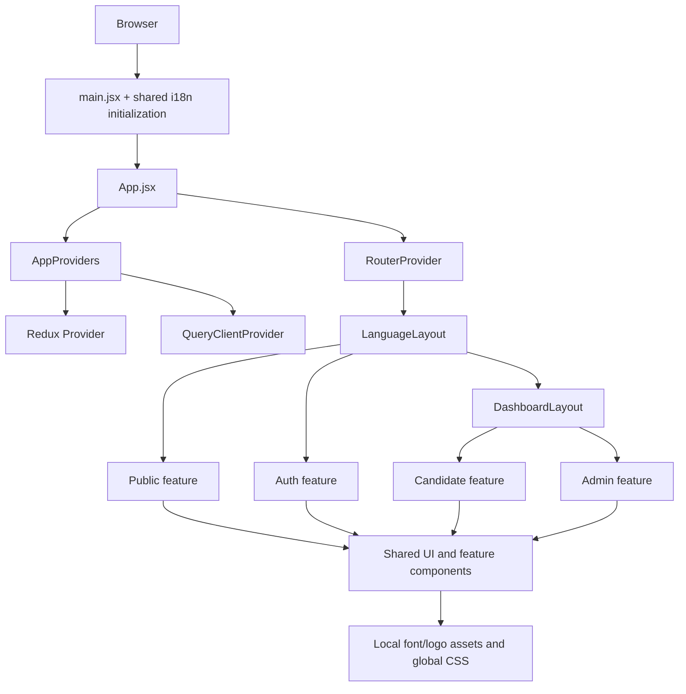

# MatchIn Frontend — Codebase Architecture & Developer Guide

> **Document type:** Living frontend architecture and maintenance guide
> **Last refreshed:** 2026-09-24
> **Committed code baseline:** `c259f2d` (`ahmed`, also `origin/main` at refresh time)
> **Working-tree scope:** Includes the current modified `src/app/routes/dashboard.routes.jsx` and five untracked admin/skeleton files. Those additions are marked **WIP** throughout this document.
> **Validation at refresh:** `npm run build` passes; `npm run lint` reports **0 errors and 34 warnings**.
> **Change policy:** This refresh audits the implementation but changes no application source files.

---

## Table of Contents

1. [Executive Snapshot](#1-executive-snapshot)
2. [Changes Since the Previous Guide](#2-changes-since-the-previous-guide)
3. [Technology Stack](#3-technology-stack)
4. [Runtime Architecture](#4-runtime-architecture)
5. [Source Layout and Ownership](#5-source-layout-and-ownership)
6. [Feature-Domain Map](#6-feature-domain-map)
7. [Routing and Role Selection](#7-routing-and-role-selection)
8. [Layouts, Navigation, and Route Metadata](#8-layouts-navigation-and-route-metadata)
9. [Authentication and Authorization](#9-authentication-and-authorization)
10. [API, TanStack Query, Redux, and Mock Data](#10-api-tanstack-query-redux-and-mock-data)
11. [Forms and Validation](#11-forms-and-validation)
12. [UI System, Styling, Motion, and Feedback](#12-ui-system-styling-motion-and-feedback)
13. [Internationalization and RTL](#13-internationalization-and-rtl)
14. [Naming, Imports, Exports, and Placement](#14-naming-imports-exports-and-placement)
15. [Dependency Guide](#15-dependency-guide)
16. [Development Workflows](#16-development-workflows)
17. [Current Gaps and Risks](#17-current-gaps-and-risks)
18. [Developer Cheat Sheet](#18-developer-cheat-sheet)

---

## 1. Executive Snapshot

MatchIn is a role-oriented React single-page application for a public job platform. It currently contains four feature domains:

- `public` — landing page and 404 page.
- `auth` — login, registration, OTP, CV upload, password recovery, and password reset UX.
- `candidate` — jobs, saved jobs, applications, profile, CV management, notifications, onboarding, roadmap, AI chat, and overview.
- `admin` — administrative overview, job management, and **WIP** user/job management pages.

The application has moved beyond the small, single-screen prototype described by the previous guide. It now has a modular route tree, role-oriented feature groups, broad candidate workflows, an admin area, shared loading/empty/error patterns, Arabic/English localization, and substantially more UI primitives.

However, it is still primarily a **high-fidelity frontend implementation backed by local/static data**. Authentication, mutations, and feature data are not consistently connected to a backend. TanStack Query and Redux are mounted at the root but are not yet the source of feature data or authenticated user state.

### 1.1 Current Size

Counts below include the current working tree and exclude `node_modules/` and generated `dist/`:

| Area | Current count / state |
| :--- | :--- |
| Files physically under `src/` | 440, including 147 local font files |
| JavaScript/JSX modules | 273: 228 `.jsx` and 45 `.js` |
| Feature modules | 193 across four domains |
| Admin feature modules | 37, including three WIP pages |
| Auth feature modules | 29 |
| Candidate feature modules | 102 |
| Public feature modules | 25 |
| Global UI primitives | 20 |
| Static/mock constant modules | 18 |
| Tests | None found; no `test` script is defined |

### 1.2 Committed Change Since the Previous Guide Snapshot

From the guide's last code-aligned snapshot (`a6e7caa`) to `c259f2d`:

- 27 commits landed, including 15 non-merge commits.
- 232 tracked files changed.
- 4,647 lines were added and 1,489 removed.
- The codebase was reorganized around role-oriented feature groups.
- Candidate and admin functionality expanded substantially.
- Authentication UX was refactored and expanded.
- Layouts were moved out of the misleading `layouts/auth/` directory.
- Localization and RTL support were introduced.

The current working tree adds one modified route module and five untracked files that are documented as WIP rather than stable architecture.

### 1.3 Build and Quality Snapshot

| Check | Result |
| :--- | :--- |
| `npm run build` | Passes with Vite 8.2.2 |
| Production JavaScript | Approximately 1.08 MB before gzip; approximately 327 KB gzip |
| `npm run lint` | 34 warnings, 0 errors |
| Unit/component tests | Not configured or present |
| Type checking | Not configured; the project is JavaScript/JSX |

The build succeeding does not imply backend integration: most asynchronous behavior is simulated inside components with `setTimeout` and local state.

---

## 2. Changes Since the Previous Guide

The previous guide is no longer an accurate description of this repository. The major changes are:

### 2.1 Feature Reorganization

The former top-level feature folders such as `HomePage`, `Auth`, `jobsFeed`, `applications`, `profile`, `roadmap`, and `userDashboard` were consolidated into:

```text
src/features/
├── public/
├── auth/
├── candidate/
└── admin/
```

`candidate` now acts as an aggregate feature area containing the candidate-facing pages and their feature-local components.

### 2.2 New Candidate Surface

The current candidate area includes page modules for:

- Overview
- Jobs and job details
- Saved jobs
- Application tracker and application details
- Candidate profile
- CV management
- Notifications
- Onboarding
- Roadmap and roadmap details
- AI chat

These pages are substantially more complete than the old one-page dashboard described in the previous guide, but most continue to use local mock datasets and local component state.

### 2.3 New Admin Surface

Committed admin work currently provides:

- `AdminOverview`
- `JobManagement`
- Reusable admin filter/state components under `src/features/admin/shared/`
- An admin-specific route branch and sidebar metadata

The current working tree additionally contains these **WIP** pages:

- `src/features/admin/pages/JobDetailsPage.jsx`
- `src/features/admin/pages/UserManagementPage.jsx`
- `src/features/admin/pages/UsersDetailsPage.jsx`

It also adds reusable skeleton components:

- `src/components/layouts/skeleton/StatsStripSkeleton.jsx`
- `src/components/layouts/skeleton/UsersTableSkeleton.jsx`

### 2.4 Authentication Refactor

Authentication files were moved from `features/Auth/` to `features/auth/` and reorganized under `components/`, `pages/`, `schema/`, `shared/`, and `api/`.

The old duplicate implementations were partly resolved by introducing shared auth components such as:

- `PasswordInput.jsx`
- `SequentialFormMessage.jsx`
- `AuthHeader.jsx`
- `SecurityNotice.jsx`
- `AuthSidePanel.jsx`

The malformed `Authsidepanel .jsx` filename no longer exists.

### 2.5 Layout Restructuring

Layouts are now directly under `src/components/layouts/`:

- `MainLayout.jsx`
- `AuthLayout.jsx`
- `DashboardLayout/`

The previous `src/components/layouts/auth/` grouping has been removed.

### 2.6 Localization and RTL

A shared localization layer now exists under `src/components/shared/i18n/`, with English and Arabic resources. Language switching, stored language preference, and RTL-aware CSS work are part of the current application.

### 2.7 UI Expansion

The UI primitive layer now contains 20 primitives, including newer additions such as `avatar.jsx`, `sheet.jsx`, and `skeleton.jsx`. Shared application components now include page headers, language controls, modals, status views, toasts, and action banners.

---

## 3. Technology Stack

| Concern | Technology |
| :--- | :--- |
| UI runtime | React 19.2.8 / React DOM 19.2.8 |
| Build | Vite 8.2.2 with `@vitejs/plugin-react` |
| Styling | Tailwind CSS 4.3.3 through `@tailwindcss/vite` |
| Routing | React Router DOM 7.18.3 |
| Component primitives | shadcn/ui-style components using Radix UI and CVA |
| Animation | Framer Motion 13.2.0 |
| Forms | React Hook Form 7.88.0 and Zod 4.6.1 |
| Resolver bridge | `@hookform/resolvers` 5.9.1 |
| Server-state infrastructure | TanStack React Query 5 |
| Client-state infrastructure | Redux Toolkit and React Redux |
| HTTP | Axios 1.20.0 |
| Icons | Lucide React |
| Internationalization | i18next and react-i18next |
| Linting | Oxlint |
| Language | JavaScript and JSX; no TypeScript source setup |

React Compiler is not enabled. The project does not define unit-test, formatting, type-check, or CI scripts.

---

## 4. Runtime Architecture

### 4.1 Bootstrap Flow

```text
src/main.jsx
  ├── imports src/index.css
  ├── initializes shared i18next resources
  └── mounts <App /> in React StrictMode
              │
              ▼
src/app/App.jsx
      │
      └── AppProviders
          ├── Redux <Provider>
          └── TanStack QueryClientProvider
              └── React RouterProvider
                      │
                      ▼
              src/app/router.jsx
                      │
                      ├── / -> RootRedirect -> /en or /ar
                      ├── /:lang -> LanguageLayout
                      │     ├── RouteTracker
                      │     ├── I18nSync
                      │     └── public/auth/dashboard routes
                      └── * -> NotFoundPage
```

`src/main.jsx` imports the active shared i18n module before mounting React. `App.jsx` adds the root providers and router. Redux wraps Query, which wraps `RouterProvider`. Language synchronization is performed by `LanguageLayout`, not by `AppProviders`.

### 4.2 Architectural Classification

The current structure is a **role-first hybrid feature architecture**:

- Top-level feature domains represent audience or role: `public`, `auth`, `candidate`, and `admin`.
- Each domain owns feature-local pages, components, hooks, schemas, and shared components where appropriate.
- Cross-domain infrastructure remains centralized under `src/app`, `src/components`, `src/lib`, `src/services`, `src/store`, and `src/utils`.
- Static domain data is still mostly centralized in `src/constants/`.

### 4.3 Layer Model



### 4.4 Provider Intent Versus Current Use

- Redux is mounted, but the store has an empty reducer map and no slices.
- TanStack Query and its devtools are mounted, but the current `src/` tree contains no `useQuery`, `useMutation`, or `useQueryClient` calls.
- Most data is imported from constants or declared directly in component modules.
- Most simulated server operations are managed with local `useState` and `setTimeout`.

This distinction is important: infrastructure presence must not be interpreted as live data integration.

---

## 5. Source Layout and Ownership

### 5.1 Major Source Tree

The following is a practical map rather than an exhaustive listing of every page-local component:

```text
src/
├── app/
│   ├── App.jsx
│   ├── providers.jsx
│   ├── router.jsx
│   ├── providers/
│   │   └── I18nProvider.jsx            # Empty, currently unused
│   └── routes/
│       ├── RootRedirect.jsx
│       ├── RouteTracker.jsx
│       ├── LanguageLayout.jsx
│       ├── auth.routes.jsx
│       └── dashboard.routes.jsx
├── assets/
│   ├── fonts/                         # Local Inter, Tajawal, DM Sans, and Alexandria files
│   ├── icons/                         # Third-party/service icons
│   └── logo/                          # MatchIn light/dark/wordmark assets
├── components/
│   ├── layouts/
│   │   ├── AuthLayout.jsx
│   │   ├── MainLayout.jsx
│   │   ├── DashboardLayout/
│   │   │   ├── DashboardLayout.jsx
│   │   │   ├── DashboardFooter.jsx
│   │   │   ├── Sidebar.jsx
│   │   │   └── Topbar.jsx
│   │   └── skeleton/
│   │       ├── ApplicationSkeleton.jsx
│   │       ├── JobDetailsSkeleton.jsx
│   │       ├── StatsStripSkeleton.jsx              # WIP
│   │       └── UsersTableSkeleton.jsx              # WIP
│   ├── shared/
│   │   ├── ActionBanner.jsx
│   │   ├── JobCard.jsx
│   │   ├── LanguageSwitcher.jsx
│   │   ├── LanguageToggle.jsx
│   │   ├── Loader.jsx
│   │   ├── Modal.jsx
│   │   ├── Navbar.jsx
│   │   ├── PageHeader.jsx
│   │   ├── Status.jsx
│   │   ├── Toast.jsx
│   │   └── i18n/
│   └── ui/                            # 20 shadcn/Radix-style primitives
├── constants/                         # 18 static data/style modules
├── features/
│   ├── public/
│   ├── auth/
│   ├── candidate/
│   └── admin/
├── lib/
│   ├── axios.js
│   ├── i18n.js
│   ├── queryClient.js
│   └── utils.js
├── services/
│   └── axios/
│       ├── axiosInstance.js
│       └── interceptors.js
├── store/
│   └── index.js
├── utils/
│   ├── buildSidebarNav.js
│   └── routes.js
├── index.css
└── main.jsx
```

`src/hooks/` and `src/pages/` exist as workspace directories but do not own the current source implementation. Feature hooks and pages live under their feature domains.

### 5.2 Responsibility Matrix

| Directory | Responsibility |
| :--- | :--- |
| `src/app/` | Application bootstrap, providers, router composition, route modules, redirects, and route tracking |
| `src/assets/` | Local fonts, logos, and service icons |
| `src/components/layouts/` | Auth, public, and dashboard/admin page shells |
| `src/components/shared/` | Cross-feature application components and localization infrastructure |
| `src/components/ui/` | Reusable low-level UI primitives |
| `src/constants/` | Static/mock datasets, route/navigation metadata, and style lookup maps |
| `src/features/` | Role/domain business UI, pages, feature components, schemas, and feature-local state |
| `src/lib/` | Reusable clients and framework configuration |
| `src/services/` | Axios instances and interceptors |
| `src/store/` | Redux store and future global client slices |
| `src/utils/` | Route constants and sidebar navigation construction |

---

## 6. Feature-Domain Map

### 6.1 Public Domain — `src/features/public/`

Purpose: public acquisition and fallback pages.

- `pages/HomePage.jsx` composes the landing-page sections.
- `pages/NotFoundPage.jsx` renders the catch-all 404 page.
- `components/HomePage/` contains the header, footer, hero, jobs preview, categories, philosophy, “why MatchIn,” CTA, and newsletter sections.
- `hooks/` contains `useCountUp.js` and `useMouseSpotlight.js`.

The landing page is visually complete but remains data-driven primarily by static constants and local interactions.

### 6.2 Auth Domain — `src/features/auth/`

Purpose: unauthenticated identity and account-recovery workflows.

```text
auth/
├── api/auth.api.js
├── components/
│   ├── LoginPage/
│   ├── RegisterPage/
│   └── SetNewPasswordPage/
├── pages/
│   ├── LoginPage.jsx
│   ├── RegisterPage.jsx
│   ├── ForgetPasswordPage.jsx
│   └── SetNewPassword.jsx
├── schema/
│   ├── auth-schema.js
│   ├── cv-schema.js
│   ├── login-schema.js
│   ├── newPassword-schema.js
│   └── profile-schema.js
└── shared/
    ├── AuthCard.jsx
    ├── AuthHeader.jsx
    ├── AuthSidePanel.jsx
    ├── PasswordInput.jsx
    ├── SecurityNotice.jsx
    └── SequentialFormMessage.jsx
```

The registration UX remains a four-phase local wizard. The API module exists, but it does not yet define or call backend authentication endpoints.

### 6.3 Candidate Domain — `src/features/candidate/`

Purpose: candidate workspace and job-search workflows.

Current page modules:

| Page | Route intent |
| :--- | :--- |
| `Overview.jsx` | Candidate dashboard |
| `JobsPage.jsx` | Job discovery/filtering |
| `JobsDetails.jsx` | Job detail and application flow |
| `SavedJobs.jsx` | Saved-job list and bulk interactions |
| `ApplicationPage.jsx` | Application tracker |
| `ApplicationDetail.jsx` | Application detail/timeline/notes |
| `ProfilePage.jsx` | Candidate profile tabs and completion |
| `CvManagementPage.jsx` | CV upload/extraction review |
| `NotificationsPage.jsx` | Notification list |
| `OnboardingPage.jsx` | Candidate onboarding wizard |
| `RoadmapPage.jsx` | Roadmap board |
| `RoadmapDetailsPage.jsx` | Role-specific roadmap detail |
| `AiChatPage.jsx` | AI mentor/chat interface |

Feature-local components are grouped by page/capability under `components/`, such as `JobsPage/`, `ApplicationDetail/`, `ProfilePage/`, and `RoadmapPage/`. `schema/onboardingSchema.js` currently owns the candidate feature's Zod schema.

The breadth of the UI is production-like, but data ownership is still primarily local/static.

### 6.4 Admin Domain — `src/features/admin/`

Purpose: platform administration.

Committed structure:

```text
admin/
├── components/
│   ├── adminDashboard/
│   └── jobManagement/
├── pages/
│   ├── AdminOverview.jsx
│   └── JobManagement.jsx
└── shared/
```

`admin/shared/` contains feature-specific reusable controls and states including search, filter pills, sorting, freshness/source/status badges, empty/error states, avatars, and motion helpers.

**WIP working-tree additions:**

- `pages/JobDetailsPage.jsx` — mock job detail, edit/status/delete actions, metrics, and related-job presentation.
- `pages/UserManagementPage.jsx` — mock user table, search/filter/sort/pagination, and management modals.
- `pages/UsersDetailsPage.jsx` — mock account/profile/CV/application/saved-job detail with local mutations.

These files are not yet committed and still contain mock request functions, TODOs, and route inconsistencies documented in Section 17.

---

## 7. Routing, Localization, and Role Selection

### 7.1 Router Engine and Language Prefix

Routing uses React Router 7's `createBrowserRouter` and `RouterProvider`. Every application page lives below a language segment:

```text
/en/...
/ar/...
```

`/` is handled by `RootRedirect`, which redirects to the last stored supported language or `/en`. `LanguageLayout` accepts only `en` and `ar`; unsupported language segments redirect to `/en`. It also mounts `RouteTracker` and `I18nSync` before rendering the route outlet.

Route composition is split between:

- `src/app/router.jsx` — top-level route and language-layout assembly.
- `src/app/routes/auth.routes.jsx` — authentication route children.
- `src/app/routes/dashboard.routes.jsx` — candidate/admin route selection and metadata.
- `src/app/routes/RootRedirect.jsx` — stored-language redirect.
- `src/app/routes/RouteTracker.jsx` — persists the current language segment.
- `src/app/routes/LanguageLayout.jsx` — language validation, tracking, i18n/document direction, and outlet.

All route imports are eager. This contributes to a single large production JavaScript bundle; route-level lazy loading is a recommended future improvement.

### 7.2 Route Inventory

The table shows canonical localized URLs. Replace `{lang}` with `en` or `ar`.

| URL | Component | Purpose | Current status |
| :--- | :--- | :--- | :--- |
| `/` | `RootRedirect` | Redirect to stored/default language | Public |
| `/{lang}` | `HomePage` | Public landing page | Public |
| `/{lang}/auth/login` | `LoginPage` | Login | Public |
| `/{lang}/auth/register` | `RegisterPage` | Registration/OTP/CV/profile wizard | Public |
| `/{lang}/auth/reset-password` | `SetNewPassword` | New-password/reset-state flow | Public |
| `/{lang}/auth/forgot-password` | `ForgetPasswordPage` | Password recovery request | Public |
| `/{lang}/dashboard` | `AdminOverview` | Admin dashboard | Selected in current build |
| `/{lang}/dashboard/job-management` | `JobManagement` | Job administration | Committed |
| `/{lang}/dashboard/user-management` | `UserManagementPage` | User administration | WIP |
| `/{lang}/dashboard/users/:id` | `UsersDetailsPage` | User detail | WIP; parameter/link mismatch |
| `/{lang}/dashboard/jobs/:id` | `JobDetailsPage` | Admin job detail | WIP; parameter/link mismatch |
| `/{lang}/dashboard` | `Overview` | Candidate dashboard | Defined but not selected while `role === "admin"` |
| `/{lang}/dashboard/notifications` | `NotificationsPage` | Candidate notifications | Defined, currently inactive |
| `/{lang}/dashboard/profile` | `ProfilePage` | Candidate profile | Defined, currently inactive |
| `/{lang}/dashboard/jobs` | `JobsPage` | Candidate job search | Defined, currently inactive |
| `/{lang}/dashboard/jobs/:jobId` | `JobsDetails` | Candidate job detail | Defined, currently inactive |
| `/{lang}/dashboard/saved-jobs` | `SavedJobs` | Saved jobs | Defined, currently inactive |
| `/{lang}/dashboard/cv-management` | `CvManagementPage` | CV management | Defined, currently inactive |
| `/{lang}/dashboard/ai-chat` | `AiChatPage` | AI chat | Defined, currently inactive |
| `/{lang}/dashboard/roadmap` | `RoadmapPage` | Roadmap | Defined, currently inactive |
| `/{lang}/dashboard/roadmap/:roleId` | `RoadmapDetailsPage` | Roadmap details | Defined, currently inactive |
| `/{lang}/dashboard/onboarding` | `OnboardingPage` | Candidate onboarding | Defined, currently inactive |
| `/{lang}/dashboard/applications` | `ApplicationPage` | Application tracker | Defined, currently inactive |
| `/{lang}/dashboard/applications/:applicationId` | `ApplicationDetail` | Application details | Defined, currently inactive |
| `*` | `NotFoundPage` | Catch-all page | Public fallback |

There is no frontend `/admin` route. Backend endpoint examples beginning with `/admin/...` do not imply corresponding frontend URLs.

### 7.3 Current Role Selector Is a Development Switch

`src/app/routes/dashboard.routes.jsx` currently contains:

```javascript
const role = "admin";

export const dashboard =
  role !== "admin"
    ? userDashboard
    : [/* admin routes */];
```

This means the candidate route array is present but not exported or selected in the current build. Both arrays share the same `/{lang}/dashboard` URL namespace, so only one can be mounted at a time.

This is not role-based authorization; it is a hardcoded development branch. The current dashboard also has no authentication/role guard. A production implementation should derive role from authenticated user state and enforce authorization on the backend. Client-side route selection alone is not a security boundary.

### 7.4 Route Metadata

Dashboard routes use a custom `handle` object:

```javascript
handle: {
  label: "Explore Jobs",
  labelKey: "navigation.exploreJobs",
  icon: Compass,
  sidebar: true,
}
```

`Sidebar.jsx` passes the selected `dashboard` array to `buildSidebarNav`, which keeps routes with `handle.sidebar === true`, localizes the dashboard base path, and converts route config into `NavLink` items. `labelKey` is translated through the `dashboard` namespace.

The current topbar does not derive a page title from this metadata, and only some pages provide their own breadcrumbs. Developers should not assume `handle` currently drives all titles or breadcrumbs.

### 7.5 Parameter and Link Contract

Route parameters must match the names consumed by pages. Both current WIP detail routes violate this rule:

- `users/:id` is registered, but `UsersDetailsPage` reads `userId`.
- `jobs/:id` is registered, but `JobDetailsPage` reads `jobId`.

The WIP pages also navigate to unregistered, nonlocalized `/admin/users/...` and `/admin/jobs...` URLs. Their links must use `useLocalizedPath`/the active language and the canonical `/{lang}/dashboard/...` paths.

The committed `JobManagement` row actions still use `href="#"`, so the new job-detail route is not reachable from that list yet.

---

## 8. Layouts, Navigation, and Route Metadata

### 8.1 `MainLayout`

`src/components/layouts/MainLayout.jsx` is the public router shell. It provides the route outlet/context used by public pages without the dashboard sidebar or topbar.

### 8.2 `AuthLayout`

`src/components/layouts/AuthLayout.jsx` composes authentication screens from reusable slots such as the side panel, card, header, security notice, and footer actions.

Current implementation still passes `children` as a component prop, which triggers an Oxlint warning. Prefer JSX children composition.

### 8.3 `DashboardLayout`

`src/components/layouts/DashboardLayout/DashboardLayout.jsx` is shared by candidate and admin workspaces. It composes `Sidebar`, `Topbar`, `DashboardFooter`, optional `children`, and a router `Outlet`. Collapse and mobile-open state live in the layout and are passed to the sidebar.

The router currently instantiates it with hardcoded candidate values:

```jsx
<DashboardLayout userName="Alex Mercer" userRole="Senior Dev" />
```

Those values are shown even when the hardcoded admin branch is active. They must be replaced by authenticated user/session data. The layout is no longer incorrectly nested under an `auth/` directory.

### 8.4 Sidebar

`Sidebar.jsx` builds navigation from the currently exported `dashboard` route array, not from an independent role model. It uses `buildSidebarNav` plus `useLocalizedPath`, supports desktop collapse, and implements its mobile overlay/drawer directly with fixed-position elements.

`DashboardFooter.jsx` still contains four `href="#"` placeholders. The sidebar's AI mentor callout is also still `href="#"`.

### 8.5 Topbar

`Topbar.jsx` provides:

- A non-functional search input with a visual `⌘S` hint
- Language switching that replaces the language segment while preserving path/query/hash
- Candidate notification dropdown UI, even when the admin route branch is active
- Hardcoded user name/role and an avatar placeholder

It does not currently derive page titles or breadcrumbs from route `handle` metadata. Breadcrumbs are page-specific (for example, `Overview/DashboardBreadcrumb.jsx`).

### 8.6 Navigation Rules

- Use `Link` or `NavLink` from React Router for internal navigation.
- Use `useLocalizedPath`/`localizedPath` so links retain the active language segment.
- Register a route before linking to it.
- Do not use `href="#"` as a placeholder in committed code.
- Keep sidebar visibility and translated labels in route `handle` metadata.
- Use React Router `<Link>`, not `<a href>`, for internal SPA navigation.
- Feature actions that change URL state should use route params/search params rather than parallel local state.

---

## 9. Authentication and Authorization

### 9.1 Current Login Flow

The login experience has a dedicated `LoginForm`, localized labels, Zod validation, and the shared sequential error pattern. However, submission is not an authentication flow yet:

1. React Hook Form validates the fields.
2. `LoginForm` calls its `onSubmit` callback.
3. `LoginPage` only runs `console.log("Login submitted:", data)`.
4. No request, token write, user state, navigation, pending state, or server-error state occurs.

The Google button is also presentation-only. `src/features/auth/api/auth.api.js` contains only an unused import of the service Axios client and defines no login request.

### 9.2 Registration Flow

`RegisterPage.jsx` orchestrates four local phases:

```text
1. Account form
   └── full name, email, password, confirmation, terms
          ▼
2. OTP confirmation
   └── six-digit code and resend timer
          ▼
3. CV upload
   └── PDF/DOC/DOCX validation and simulated processing
          ▼
4. Profile completion
   └── mocked extraction and review
          ▼
Candidate dashboard navigation
```

`RegisterStep` immediately moves from account form to OTP; register, verify-OTP, and resend calls are TODOs. CV upload and profile analysis use `setTimeout` and local mock data. Final profile data is not submitted.

The CV skip/final actions navigate to candidate URLs, but the current `role = "admin"` route selector means those candidate routes are not mounted. Current completion therefore lands on the admin dashboard rather than the candidate destination encoded in the flow.

### 9.3 Password Recovery and Reset

- `ForgetPasswordPage.jsx` validates an email with an inline Zod schema and waits two seconds before showing success. Its error branch is currently unreachable because the simulated promise does not reject.
- `SetNewPassword.jsx` uses React Hook Form + `newPasswordSchema`, then waits 1.5 seconds before showing completion.
- The page renders `verifying`, `expired`, and `error` states, but no current action transitions into those states.
- The completion action uses a raw `<a href>` instead of React Router `<Link>`.
- Security messaging is centralized in the auth shared area.

These flows are UI simulations, not reset-token API integrations.

### 9.4 Token and Session Handling

No current auth flow writes a token. The Axios files merely look for `localStorage.getItem("token")` before requests. The `lib/axios.js` response interceptor removes that key on 401; the service interceptor has no response handler. The installed `js-cookie` package is not used by the current source.

Redux has no auth slice, and the dashboard layout receives hardcoded user props. A production session design must define one source of truth for:

- Access/refresh token storage
- Token expiry and refresh
- Current user profile
- Role/permissions
- Logout and 401 recovery
- Cross-tab synchronization

Never rely on `localStorage`, a cookie, or a client-side role variable as the sole security mechanism. The backend must authorize every protected operation.

### 9.5 Current Protection Status

There is currently no authentication guard or role guard in the route tree. Any visitor can open `/{lang}/dashboard` and the selected admin routes. The hardcoded role selector and hardcoded layout identity are development scaffolding, not access control.

---

## 10. API, TanStack Query, Redux, and Mock Data

### 10.1 Current API Infrastructure

Two Axios configurations still coexist:

| File | Export | Environment | Timeout | Current role |
| :--- | :--- | :--- | :--- | :--- |
| `src/lib/axios.js` | `apiClient` | `VITE_API_BASE_URL` with local fallback | 15 seconds | Legacy/secondary setup |
| `src/services/axios/axiosInstance.js` | `api` | `VITE_API_URL` | 10 seconds | Intended shared service client |

`src/services/axios/interceptors.js` registers a request token interceptor only when that module is imported. Nothing currently imports it: `auth.api.js` imports `axiosInstance.js` directly. The service client therefore has no active auth interceptor. `src/lib/axios.js` does attach both request and 401 response interceptors internally, but no feature imports `apiClient`.

No current feature executes an HTTP request. The previous recommendation to consolidate Axios remains valid: register one client and its interceptors in one place, then make new code choose that client deliberately.

### 10.2 Environment Variables

- `.env` is ignored by Git.
- The application expects Vite-prefixed variables such as `VITE_API_URL`.
- Do not commit secrets or assume a developer's local `.env` exists in CI.
- Add a sanitized `.env.example` when backend integration begins.

### 10.3 TanStack Query

`src/lib/queryClient.js` creates the shared Query client, and `src/app/providers.jsx` mounts `QueryClientProvider` and devtools.

No current feature uses Query. There are zero `useQuery`, `useMutation`, or `useQueryClient` calls under `src/`. Pages use:

- Static imports from `src/constants/`
- Component-local arrays/objects
- `useState`
- `setTimeout`-based loading simulation

For new server-backed features:

1. Put HTTP calls in a feature API module.
2. Return normalized response data from the API function.
3. Wrap reads in feature-local `useQuery` hooks.
4. Wrap writes in feature-local `useMutation` hooks.
5. Use a query-key factory and invalidate only affected keys.
6. Render `isPending`, `isError`, empty, and success states explicitly.

### 10.4 Redux Toolkit

`src/store/index.js` configures the Redux store, but the current feature architecture does not depend on Redux slices for server data or session state.

Redux should be reserved for durable cross-route client state, for example:

- Authenticated user/session summary
- Global theme/language preference if not owned by i18n
- Cross-route draft state
- Global UI state that cannot be derived from the URL or server cache

Do not duplicate Query cache data in Redux.

### 10.5 Static and Mock Data

`src/constants/` currently owns 18 modules, including job, category, application, notification, roadmap, pipeline, navigation, and style-map data. Some pages also declare substantial mock records directly in their own modules.

Before backend integration, move large domain datasets behind API/query boundaries rather than continuing to grow page-local mock objects.

---

## 11. Forms and Validation

### 11.1 Standard Form Stack

The primary form stack is:

- React Hook Form for field and submission state.
- Zod for runtime validation.
- `zodResolver` from `@hookform/resolvers/zod`.
- Shared shadcn-style form/field/input primitives.

### 11.2 Auth Schemas

| Schema | Responsibility |
| :--- | :--- |
| `auth-schema.js` | Registration fields, password rules, terms, password confirmation, OTP |
| `login-schema.js` | Email and password validation |
| `cv-schema.js` | Accepted file types and size validation |
| `newPassword-schema.js` | New-password strength and confirmation |
| `profile-schema.js` | Registration profile fields and skills |

### 11.3 Candidate Validation

`src/features/candidate/schema/onboardingSchema.js` exports a required-field schema used directly with `safeParse` inside `ChipSelectStep`; onboarding does not use React Hook Form. `ForgetPasswordPage` similarly owns an inline email schema and controlled state. Other candidate tabs mix controlled local state and presentation-only save behavior. Standardize these flows when persistence is connected.

### 11.4 Sequential Form Errors

`src/features/auth/shared/SequentialFormMessage.jsx` centralizes the one-error-at-a-time animated auth error pattern. New auth forms should reuse it rather than copying the logic.

The pattern improves focus, but forms must still expose an accessible summary or appropriate field association for assistive technology.

### 11.5 Admin Form Drift

The WIP admin user pages use local controlled form state and simple disabled-button checks rather than React Hook Form + Zod. This is acceptable only while the pages are prototypes. Before commit/production integration, move user create/edit/role/status operations behind validated mutation hooks.

---

## 12. UI System, Styling, Motion, and Feedback

### 12.1 Tailwind CSS v4

The project uses Tailwind v4 through the Vite plugin. There is no legacy `tailwind.config.js`; design tokens live in `src/index.css`, primarily through `@theme`.

Use semantic theme classes such as:

- `bg-background`
- `bg-surface`
- `text-primary`
- `text-secondary`
- `text-ink`
- `text-muted`
- `border-border`
- `text-success`, `text-warning`, `text-error`

The current code still contains arbitrary colors and shadow values, so “theme tokens only” is a direction for consistency rather than a fully achieved rule.

### 12.2 Global UI Primitives

`src/components/ui/` contains:

```text
avatar.jsx       badge.jsx       button.jsx      card.jsx
checkbox.jsx     command.jsx     dialog.jsx      field.jsx
form.jsx         input.jsx       input-otp.jsx   label.jsx
popover.jsx      progress.jsx    select.jsx      separator.jsx
sheet.jsx        skeleton.jsx    tabs.jsx        textarea.jsx
```

These are the canonical reusable form, overlay, navigation, feedback, and layout primitives. Check this directory before creating a new low-level primitive.

### 12.3 Class Name Utility

`src/lib/utils.js` is the canonical `cn` helper built with `clsx` and `tailwind-merge`. New and modified code should import it through the alias:

```javascript
import { cn } from "@/lib/utils";
```

The separate `cn` npm dependency remains in `package.json`. If it is no longer required, remove it rather than allowing two class-merging conventions.

### 12.4 Local Fonts and Branding

Local font assets are committed for Inter, Tajawal, and DM Sans. Logo assets include light, dark/navy, icon, and wordmark variants. Prefer these local assets over remote font/image dependencies.

### 12.5 Motion

Framer Motion is used for:

- Landing-page reveals and hover interactions
- Count-up metrics
- Modal/toast transitions
- Dashboard card/list entry
- Auth step/error transitions

Keep animation durations and easing consistent with existing components and respect reduced-motion expectations for nonessential effects.

### 12.6 Loading, Empty, and Error States

The application now has a more deliberate state-view vocabulary:

- `Loader2` spinners
- Skeleton primitives
- Admin `EmptyState` and `ErrorState`
- Application/AI chat specific error views
- Job detail/list loading and empty views
- Auth reset and saving states
- Custom `Status` and `Toast` components

These should eventually be standardized further so the same state does not produce several unrelated visual patterns.

### 12.7 Accessibility

Radix primitives provide a strong base for dialogs, popovers, selects, tabs, checkboxes, and sheets. New code must preserve:

- Keyboard operability
- Focus management
- Semantic labels
- Visible focus states
- Sufficient contrast
- Screen-reader status/error announcements

No automated accessibility test suite is currently configured.

---

## 13. Internationalization and RTL

### 13.1 Current Implementation

Localization lives under `src/components/shared/i18n/`:

- `index.js`
- `I18nSync.jsx`
- `languageStorage.js`
- `locales/en/common.json`
- `locales/ar/common.json`

The application uses `i18next` and `react-i18next`, stores a language preference in browser storage, and provides language controls in public, auth, and dashboard contexts.

### 13.2 RTL Support

The UI has been migrated toward CSS logical properties so spacing, borders, and directional layout can adapt to Arabic. New CSS should prefer logical properties such as `ms-*`, `me-*`, `ps-*`, `pe-*`, `border-start-*`, and `border-end-*` where directional behavior matters.

Do not introduce left/right physical utilities for components that must support both English and Arabic unless the distinction is intentionally language-specific.

### 13.3 Translation Coverage

Authentication and shared navigation have meaningful translation resources. Much of the candidate/admin UI remains hard-coded English. Feature work should add translation keys when user-facing strings are introduced rather than postponing extraction.

Keep backend/network error text separate from UI copy so it can be localized consistently.

### 13.4 Legacy i18n Caveat

`src/lib/i18n.js` is a separate legacy setup and references packages not listed in `package.json`. The current build succeeds because the active shared i18n path does not require those missing packages. Remove or repair the legacy file to prevent future accidental imports from breaking the build.

---

## 14. Naming, Imports, Exports, and Placement

### 14.1 Naming Conventions

| Artifact | Current convention | Example |
| :--- | :--- | :--- |
| Feature domain | lowercase | `candidate`, `admin`, `auth` |
| Page component | PascalCase `.jsx` | `Overview.jsx`, `JobManagement.jsx` |
| Feature component | PascalCase `.jsx` | `PipelineStatCard.jsx` |
| UI primitive | kebab-case `.jsx` | `input-otp.jsx` |
| Hook | camelCase beginning with `use` | `useCountUp.js` |
| API module | camelCase plus `.api.js` | `auth.api.js` |
| Zod schema | filename varies; prefer kebab-case | `login-schema.js` |
| Constants | camelCase filename, often UPPER_SNAKE export | `JOB_CATEGORIES` |
| Utility | camelCase `.js` | `buildSidebarNav.js` |

The repository is not perfectly consistent. New code should follow the table and preserve readability within an existing feature.

### 14.2 Import Paths

`@/` maps to `src/` in both `vite.config.js` and `jsconfig.json`.

Prefer:

```javascript
import { Button } from "@/components/ui/button";
import { cn } from "@/lib/utils";
```

Use relative imports for tightly coupled files within the same feature, for example:

```javascript
import JobCard from "../components/JobsPage/JobCard";
```

Avoid long parent traversals such as `../../../../`.

### 14.3 Export Conventions

- Route pages commonly use default exports.
- Shared/reusable components commonly use named exports.
- UI primitives use named exports.
- Admin feature folders use `index.js` barrels selectively.
- Some WIP pages use named exports while route modules import them by name.

For a page used by the router, choose one export style and update the route import consistently. Avoid mixing default and named exports for the same component without a reason.

### 14.4 Component Placement Decision

```text
Is it a generic, reusable primitive?
└── src/components/ui/

Is it shared across unrelated features?
└── src/components/shared/

Is it only used inside one feature domain?
└── src/features/<domain>/

Is it only used by one page within a feature?
└── src/features/<domain>/components/<PageName>/
```

Do not put feature-specific admin controls into global shared components merely because they are reusable within admin.

### 14.5 Page Composition

Page modules should primarily compose feature components and connect state/data. Extract large tables, forms, status sections, and repeated cards when a page becomes difficult to scan.

The three WIP admin detail/management pages currently violate this guideline and should be split before they are treated as stable architecture.

---

## 15. Dependency Guide

| Package | Intended use | Current observation |
| :--- | :--- | :--- |
| `react`, `react-dom` | UI runtime | Used throughout |
| `react-router-dom` | Routing, links, params, route matches | Central to application shell |
| `@tanstack/react-query` | Server cache/read/mutation infrastructure | Provider mounted; little feature usage |
| `@reduxjs/toolkit`, `react-redux` | Global client state | Store mounted; no meaningful slices yet |
| `axios` | REST networking | Two configurations remain |
| `react-hook-form` | Form state | Used by auth/onboarding and selected forms |
| `zod`, `@hookform/resolvers` | Schema validation | Used in auth and onboarding |
| `framer-motion` | UI motion | Used extensively |
| `radix-ui`, `@radix-ui/react-slot` | Accessible primitives | Used by UI layer |
| `class-variance-authority` | Variant classes | Used by primitives |
| `clsx`, `tailwind-merge` | `cn` implementation | Canonical utility |
| `lucide-react` | Icons | Standard icon source |
| `i18next`, `react-i18next` | Localization | Active through shared i18n layer |
| `js-cookie` | Browser cookie access | Part of current auth/networking design; standardize before production |
| `cmdk` | Command UI | Used by command/search primitives |
| `input-otp` | OTP slots | Used by auth OTP step |
| `jest` | Test runner | Installed but no script or tests are present |
| `@types/*` | Type declarations | Present even though the source project is JavaScript |

Avoid adding a second library for a concern already covered by the stack unless there is a documented gap.

---

## 16. Development Workflows

### 16.1 Add a Feature Page

1. Place the page under the correct role/domain:
   `src/features/<domain>/pages/<PageName>.jsx`.
2. Put page-only components under:
   `src/features/<domain>/components/<PageName>/`.
3. Put cross-feature components under `src/components/shared/`.
4. Reuse or add a primitive under `src/components/ui/`.
5. Add route metadata and register the route.
6. Add loading, empty, error, and not-found behavior where relevant.
7. Add translation keys for user-facing copy.
8. Run `npm run lint` and `npm run build`.

### 16.2 Add a Backend Endpoint

1. Standardize on one Axios client.
2. Add `src/features/<domain>/api/<resource>.api.js`.
3. Keep request shaping and response normalization in the API module.
4. Add a Query key factory and feature-local query/mutation hooks.
5. Invalidate the narrowest affected Query keys after mutations.
6. Surface pending/error/success states in the component.
7. Never call Axios or `fetch` directly from a rendering component.

### 16.3 Add a Form

1. Define a Zod schema in the feature's `schema/` directory.
2. Use `zodResolver` with React Hook Form.
3. Reuse `Field`, `Form`, `Input`, `Select`, and related primitives.
4. Validate file constraints with the schema, not only UI conditionals.
5. Disable duplicate submissions and expose pending state.
6. Keep server and validation errors distinguishable.
7. Add localization keys for labels, hints, and errors.

### 16.4 Add a Dashboard Route

1. Add a feature-local page.
2. Import it in `src/app/routes/dashboard.routes.jsx` or the appropriate route module.
3. Give sidebar routes `handle.label`, `handle.labelKey`, `handle.icon`, and `handle.sidebar`.
4. Add nested children only when the URL hierarchy reflects the user task.
5. Ensure `useParams()` names match route params.
6. Test every link to and from the route.
7. Do not add a hardcoded role branch; use authenticated role state.

### 16.5 Add an Admin Feature

1. Keep admin-only primitives in `src/features/admin/shared/`.
2. Reuse admin search/filter/sort/state components before creating variants.
3. Keep page orchestration separate from large table/form rendering.
4. Add loading, empty, error, and mutation-pending states.
5. Add query/mutation hooks when connected to the API.
6. Keep the page under `src/features/admin/pages/`.

### 16.6 Validation Commands

```bash
npm run dev
npm run lint
npm run build
npm run preview
```

There is currently no reliable `npm test` command. Add and document one when a test strategy is introduced.

---

## 17. Current Gaps and Risks

### 17.1 Critical

#### 1. Role Selection Is Hardcoded

`const role = "admin"` makes the admin branch the only active dashboard route tree. Candidate routes exist but cannot be selected in the current build.

**Required action:** derive role from authenticated user state and test both branches. Keep backend authorization independent of client routing.

#### 2. WIP User Detail Route Contract Is Broken

The route uses `:id`, but `UsersDetailsPage` expects `userId`. The page also links to `/admin/users`, while the registered list route is `/admin/user-management`.

**Required action:** choose one canonical URL, align `useParams()`, and update every breadcrumb/back/detail link before committing.

#### 3. Authentication Is Not Backend-Integrated

The current auth API module defines no request functions. Login, registration, OTP, recovery, and reset behavior cannot yet establish a real server session.

**Required action:** define endpoint contracts, standardize Axios/interceptors, and move auth mutations into Query hooks or a deliberate auth service/state layer.

### 17.2 High

#### 4. Two Axios Clients Still Coexist

`src/lib/axios.js` and `src/services/axios/axiosInstance.js` use different environment variables, timeouts, and token conventions.

**Required action:** keep one client, register interceptors in the same module that creates it, and document the token lifecycle.

#### 5. Legacy i18n Setup Contains Missing Imports

`src/lib/i18n.js` is not on the active build path but references uninstalled packages.

**Required action:** remove it or make it the single tested i18n entry point.

#### 6. No Automated Tests

The repository has no test files, no test script, and no CI workflow. Jest is installed but unused.

**Required action:** prioritize tests for schemas, auth/session logic, route guards, API response mapping, and critical state transitions.

#### 7. WIP Admin Pages Are Monolithic

The three untracked admin pages are approximately 638–762 lines each and combine data simulation, tables/forms, modals, state transitions, and presentation.

**Required action:** split them into page orchestration, feature components, schemas, mock/API adapters, and shared admin primitives before commit.

### 17.3 Medium

#### 8. Lint Has 34 Warnings

Current warnings include unused imports/variables, Fast Refresh export warnings, state updates inside effects, a `children` prop, a constant logical comparison, and a React Hook Form `watch()` compiler warning.

`npm run lint` exits without errors, but warnings should be reduced to zero for a clean quality gate.

#### 9. Large Eager Bundle

The production JavaScript bundle is approximately 1.08 MB before gzip because all route pages are imported eagerly.

**Required action:** introduce route-level lazy loading and split large feature dependencies such as chat/chart-like UI where practical.

#### 10. No Application Error Boundary

Feature-specific error states exist, but there is no root React error boundary for render-time failures.

**Required action:** add a user-safe error boundary with logging/reporting integration.

#### 11. Inconsistent Feature Data Ownership

Some features read centralized constants, while others embed large page-local mock datasets and timers.

**Required action:** standardize API → Query → component data flow before adding more mutations.

#### 12. Placeholder and Dead Navigation

The WIP admin pages contain `#` links and links to unregistered paths. Some old shared components also appear orphaned.

**Required action:** run a route/link audit and remove or wire unused components before release.

### 17.4 Low

#### 13. Naming and Export Drift

The repository mixes default/named page exports, singular/plural page names, and a few inconsistent schema/component names.

**Required action:** apply the conventions in Section 14 to new work; avoid mass renames without dedicated regression passes.

#### 14. Dependency Cleanup

`cn` and `jest` are installed alongside canonical local utilities/new test plans. Type packages are installed even though the project is JavaScript.

**Required action:** verify actual imports and remove unused dependencies.

#### 15. Translation Coverage Is Uneven

Authentication/navigation are localized, while many feature strings remain hard-coded English.

**Required action:** add keys incrementally in each feature and test Arabic/RTL layouts in CI or review.

---

## 18. Developer Cheat Sheet

### 18.1 Where to Put Files

| Artifact | Destination |
| :--- | :--- |
| New public page | `src/features/public/pages/` |
| New auth page/component | `src/features/auth/pages/` or `src/features/auth/components/` |
| New candidate page | `src/features/candidate/pages/` |
| New admin page | `src/features/admin/pages/` |
| Page-local component | `src/features/<domain>/components/<Page>/` |
| Feature-local reusable component | `src/features/<domain>/components/` |
| Admin-reusable control | `src/features/admin/shared/` |
| Cross-feature component | `src/components/shared/` |
| Generic UI primitive | `src/components/ui/` |
| API adapter | `src/features/<domain>/api/` |
| Query/mutation hook | `src/features/<domain>/hooks/` |
| Zod schema | `src/features/<domain>/schema/` |
| Global mock data | `src/constants/` while prototyping only |
| Shared utility | `src/lib/` or `src/utils/` |
| Route | `src/app/routes/` plus registration in the router |

### 18.2 Top Rules

1. Use `@/lib/utils` for `cn`.
2. Use semantic Tailwind theme tokens where practical.
3. Use existing UI primitives before creating duplicates.
4. Use `Link`/`NavLink`; never commit placeholder `#` links.
5. Keep API calls outside rendering components.
6. Use TanStack Query for server data once endpoints exist.
7. Use Redux only for genuine global client state.
8. Validate forms with React Hook Form and Zod.
9. Reuse auth shared components instead of copying form/error/password logic.
10. Register dashboard route metadata consistently.
11. Match route params with `useParams()` exactly.
12. Provide loading, empty, error, and success states.
13. Add English and Arabic copy for new user-facing text.
14. Prefer logical CSS properties for RTL compatibility.
15. Keep pages as composition boundaries; extract large implementations.
16. Add route-level loading for production bundles.
17. Run `npm run lint` and `npm run build` before committing.
18. Add tests for new critical logic; do not rely on UI review alone.
19. Never treat client-side role checks as backend security.
20. Update this guide when architecture or route ownership changes.

### 18.3 Before Opening a Pull Request

```text
[ ] Correct feature-domain placement
[ ] Route registered and navigable in both directions
[ ] Route params and links match
[ ] No direct Axios/fetch calls in components
[ ] Loading/empty/error/pending states implemented
[ ] Form validation and duplicate-submit protection implemented
[ ] English/Arabic copy and RTL layout reviewed
[ ] No new placeholder/dead links
[ ] No secrets committed
[ ] npm run lint reviewed
[ ] npm run build passes
[ ] Relevant tests added/executed
[ ] This guide updated if architecture changed
```

---

**End of current architecture snapshot.**
